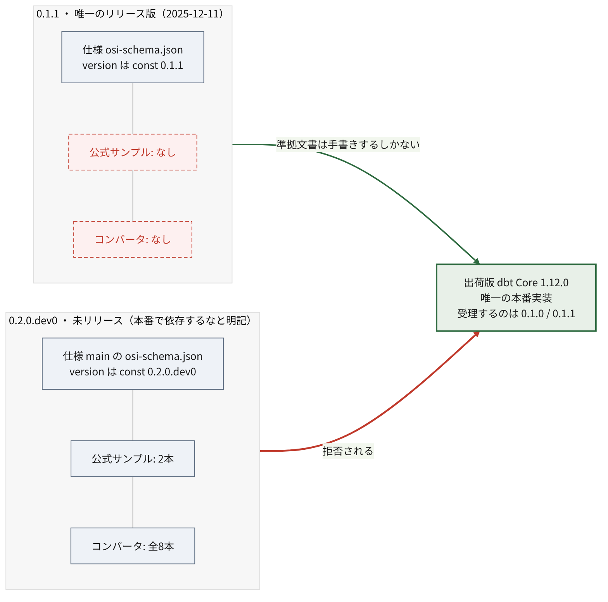

# 状況の整理 {#sec-situation}

Apache Ossie を調べようとすると、技術の中身に入る前に
**どれを見ればいいのか分からない**という壁に当たる。
名前・バージョン・ワーキンググループのいずれもが分裂しているためだ。

本章はその地形を先に片付ける。以降の章はここを前提とする。

## 名前が3つある

| 呼称 | 何を指すか |
| --- | --- |
| Open Semantic Interchange (OSI) | 2025年9月の発足時の名称。旧サイトや初期の記事はこれ |
| Apache Ossie (incubating) | 2026年6月22日の Apache Incubator 入りに伴う現名称 |
| OSI（別物） | Open Source Initiative、Open Systems Interconnection |

改名の理由は公式に明言されている。**OSI という略称が他プロジェクトと紛らわしいため**で、
仕様そのものに変更はない[^rename]。

[^rename]: Apache Ossie, "[Apache Ossie (Incubating): The New Name for Open Semantic Interchange](https://ossie.apache.org/updates/ossie-enters-apache-incubator/)", アクセス日 2026-07-19

ただし改名後の "Ossie" も完全に一意ではない。Virginia Tech 由来の
SDR（Software Defined Radio）フレームワーク OSSIE と同名である。

検索するときは注意が要る。「OSI」で引くと Open Source Initiative の記事が大量に混ざり、
2026年6月以前の記事は旧名で書かれている。

## バージョンが2つあり、どちらも中途半端

調べるうえで最も混乱しやすいのがここである。

{#fig-two-worlds}

**0.1.1** は 2025-12-11 リリースの**唯一のリリース版**。
出荷版 dbt が受理するのはこちらである。
しかし**公式サンプルもコンバータも存在しない**。

**0.2.0.dev0** は `main` ブランチの開発版。仕様本文に明記がある。

> Schema is mutable; **do not depend on this version in production**
>
> （スキーマは変わりうる。このバージョンに本番で依存しないこと。）

しかし**公式サンプル2本もリポジトリ内のコンバータ8本も、すべてこちらを対象**としている。

つまり「動く実装がある方」には手本がなく、「手本がある方」には動く実装がない。

この非対称が実害を生んでいることは @sec-verification で示す。

### ASF としての正式リリースは存在しない

さらに前提として、**Apache Release は1本も出ていない**。
3つの独立した一次情報が一致する[^norelease]。

[^norelease]: Apache Incubator, "[Clutch: ossie](https://incubator.apache.org/clutch/ossie.html)" / "[dist.apache.org 配布領域](https://dist.apache.org/repos/dist/release/incubator/)" / "[GitHub Releases API](https://api.github.com/repos/apache/ossie/releases)", いずれもアクセス日 2026-07-19

- Clutch ページが "No releases currently available"（利用可能なリリースなし）かつ
  **"No PGP Signing Keys"**（PGP 署名鍵なし）。
  署名鍵すら未登録であり、そもそも Apache Release を出せる状態にない
- `dist.apache.org/repos/dist/release/incubator/` に **ossie ディレクトリが存在しない**
- GitHub の Releases は空

存在するタグは **`osi-0.1.1-rc1` ただ1つ**。プレフィックスが `osi-` のままである点が重要で、
**改名前・ASF 移管前に打たれたタグ**である。ASF のリリースプロセス
（PPMC 投票 → IPMC 投票 → dist への配置）を通っておらず、
`-rc1` の通りリリース候補止まりで正式リリースですらない。

したがって **「v0.1 系は Apache Release ではない」**。

### 「v1.0」表記は誤りではない — 後から番号が下げられた {#sec-v10}

ベンダーブログや技術メディアが仕様を「v1.0」と表記していることがある[^v10refs]。
現在の仕様に 1.0 というバージョンは存在しないため、
これを誇張表現と受け取ってしまうかもしれない。**実際にはそうではない。**

[^v10refs]: 例: Salesforce, "[Ending Semantic Drift](https://www.salesforce.com/blog/ending-semantic-drift-unified-business-logic-foundation/)" / StartupHub.ai, "[Open Semantic Interchange v1.0 Ends Metric Drift](https://www.startuphub.ai/ai-news/ai-research/2026/open-semantic-interchange-v1-0-ends-metric-drift)", アクセス日 2026-07-19

仕様リポジトリの履歴を追うと、**仕様は実際に `Version: 1.0` を名乗っていた**。

| 期間 | `core-spec/spec.md` の宣言 |
| --- | --- |
| 2025-12-12 〜 2026-01-16 以降 | **1.0** |
| 2026-03-09 〜 2026-04-20 | 0.1.1 |
| 2026-05-19 以降 | 0.2.0.dev0 |

2026年1月27日の仕様公開時点で、仕様は 1.0 だった。
各社はそれを正確に引用していたにすぎない。

番号を下げたのは以下のコミットである[^renumber]。

[^renumber]: 旧リポジトリ [open-semantic-interchange/OSI](https://github.com/open-semantic-interchange/OSI) の履歴より。コミット `2af09b2`（2026-03-09）および `3f22030`（2026-05-19）。アクセス日 2026-07-19

- **`2af09b2`（2026-03-09、Khushboo Bhatia）** — "Version change from 1.0 to 0.1.1"
  （バージョンを 1.0 から 0.1.1 へ変更）
- **`3f22030`（2026-05-19、同）** — "Bump version to 0.2.0.dev0 on main"
  （main のバージョンを 0.2.0.dev0 へ引き上げ）。
  コミットメッセージに「release/0.1.1 を切って tag を打ったので、main は
  破壊的変更を受け入れる開発版とする。main の利用者が
  リリース済みの 0.1.1 と取り違えないようにするため」とある

::: {.callout-important}
## 読み解き

**1.0 という完成を示唆する番号を、後から 0.1.1 へ引き下げた**という事実は、
それ自体が状況を物語る。ASF 移管を前に、成熟度の表明を実態に合わせたと読める
（ただし引き下げの理由はコミットメッセージに書かれておらず、**動機は未確認**）。

したがって「v1.0」と書かれた記事を見たら、それは
**2026年3月以前の情報**である可能性が高い。誤りではないが、古い。

現在の正しい理解は「**リリース済みは 0.1.1 のみ、`main` は 0.2.0.dev0**」であり、
これはプロジェクト自身のドキュメントの記述
（"current version: 0.2.0.dev0, latest released: 0.1.1"
＝現行版は 0.2.0.dev0、最新のリリース版は 0.1.1）とも一致する。
:::

## ワーキンググループの一覧が3系統ある

公式情報の中に、粒度も名称も異なる3つの一覧が並存している。

| 出典 | 数 | 内容 |
| --- | --- | --- |
| [`docs/working_groups.md`](https://github.com/apache/ossie/blob/07be0176e48af67f0b46e0957a87a154586abf38/docs/working_groups.md) | 5 | Metric Language and Relationships / Composability / Catalog / Ontology / Sync API |
| [公式サイト トップページ](https://ossie.apache.org/) | 5 | Advanced Metrics & Expression Language / Composability / Catalog Integration / Ontology Representation / Model Converters & Developer Tools |
| [`ROADMAP.md`](https://github.com/apache/ossie/blob/07be0176e48af67f0b46e0957a87a154586abf38/ROADMAP.md) の Current Efforts | 3 | Metric Semantics & Core Semantic Model / Catalog Integration & Semantic Services / Ontology & Semantic Interoperability |
| [Incubator 入りアナウンス](https://ossie.apache.org/updates/ossie-enters-apache-incubator/) | 3 | "Three working groups (Metric Language, Catalog and Ontology)" |

リポジトリ内のファイルはコミット `07be0176`（2026-07-17）時点、
サイト側はいずれもアクセス日 2026-07-19 の内容である。

実態に最も近いのは1つ目である。

| ワーキンググループ | リード | Slack チャンネル |
| --- | --- | --- |
| Metric Language and Relationships | Will Pugh | `#metric-language-working-group` |
| Composability | Dianne Wood（AtScale） | `#wg-composability` |
| Catalog | Shubham Bhargav（Atlan） | `#wg-catalog` |
| Ontology | Kurt Stirewalt（RelationalAI） | `#osi-ontology` |
| Sync API | Francois Lopitaux（ThoughtSpot） | `#wg-sync-api` |

各グループにリード担当者と Slack チャンネルが割り当てられており、
**実際に会合が回っているのはこの単位である**と判断した。
なお同ファイルのカレンダーリンクはいずれも "link TBD" のままで、
会合日程は公開されていない。

`ROADMAP.md` にはこれとは別に「Future Efforts」7項目があり、
こちらは着手前の構想である。

- Dataset Abstraction & Logical Modeling
- Semantic Query Language & Reference Engine
- SQL Dialect, Expressions, and Execution Boundaries
- Dimensions, Hierarchies, and Time Semantics
- AI-Native Semantic Layer
- Governance, Identity, and Validation
- Industry / Domain-Specific Semantic Models

::: {.callout-note}
## 起こりやすい取り違え

Current Efforts の3件と Future Efforts の7件を一列に並べ、
「10個のワーキンググループがある」と紹介している記事がある。
筆者自身の過去記事がそうだった[^mymistake]。

[^mymistake]: dobachi, "[Open Semantic Interchange (OSI) 技術深掘り — スコープと利用実例](https://dobachi.github.io/memo-blog/2026/07/10/Open-Semantic-Interchange-technical-deep-dive/)"（2026-07-10 初版）。本調査を受けて 2026-07-19 に訂正済み。

ROADMAP の全リビジョンを追った限り、Current Efforts は 3 → 2 → 3 と推移しており、
一度も4件以上になっていない。したがって
**将来構想を現行の作業と取り違えたものと思われる。**

ただし断定は避けたい。当該記事の執筆時点で ROADMAP がどう見えていたかを
完全には再現できておらず、また節の見出しが
"Current Efforts / Working Groups" と "Future Efforts" で
視覚的に紛らわしいという事情もある。
:::

**この不整合は2026年7月時点で解消されていない。**
実際に動いているワークストリームを知りたければ、
リード担当者と Slack チャンネルが明記された `docs/working_groups.md` を見るのが確実である。

## まとめ

本章で押さえた前提を再掲する。

- 現名称は **Apache Ossie**。2026年6月以前の情報は **OSI** の名で書かれている
- リリース済みの仕様は **0.1.1 のみ**。`main` が示す `0.2.0.dev0` は
  本番依存を禁ずる旨が明記された開発版
- **Apache Release は1本も出ていない**。「v1.0」は実在しない
- ワーキンググループの一覧は公式内で3系統に分かれている。
  実態は `docs/working_groups.md` の5件
