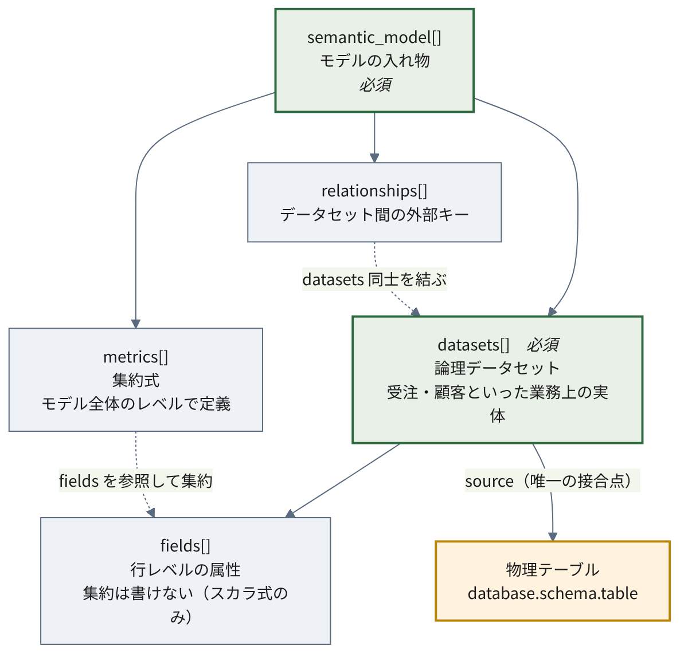
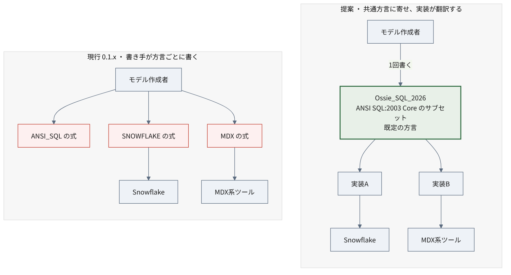

# 仕様の詳細 {#sec-spec}

本章は仕様リポジトリの一次読解にもとづく。

参照はすべて **固定コミット [`07be0176`](https://github.com/apache/ossie/blob/07be0176e48af67f0b46e0957a87a154586abf38)**（2026-07-17）に対するもので、
比較対象はタグ [`osi-0.1.1-rc1`](https://github.com/apache/ossie/tree/osi-0.1.1-rc1)。
以下、`spec.md` の行番号はこのコミット時点のものである。アクセス日はいずれも 2026-07-19。

## 規範はどれか {#sec-spec-foundation}

仕様リポジトリの `core-spec/` には複数のファイルがある。
どれが規範かを最初に決めておく必要がある。

| ファイル | 位置づけ |
| --- | --- |
| [`core-spec/osi-schema.json`](https://github.com/apache/ossie/blob/07be0176e48af67f0b46e0957a87a154586abf38/core-spec/osi-schema.json)（330行） | **規範。JSON Schema draft 2020-12。機械可読** |
| [`core-spec/spec.md`](https://github.com/apache/ossie/blob/07be0176e48af67f0b46e0957a87a154586abf38/core-spec/spec.md)（594行） | 散文の仕様書。表形式の説明 |
| [`core-spec/spec.yaml`](https://github.com/apache/ossie/blob/07be0176e48af67f0b46e0957a87a154586abf38/core-spec/spec.yaml) | YAML 形式の仕様スケッチ。第3の表現（後述） |
| [`core-spec/expression_language.md`](https://github.com/apache/ossie/blob/07be0176e48af67f0b46e0957a87a154586abf38/core-spec/expression_language.md)（35KB） | 2026-07-15 追加。後述 |
| [`validation/validate.py`](https://github.com/apache/ossie/blob/07be0176e48af67f0b46e0957a87a154586abf38/validation/validate.py)（290行） | 参照実装のバリデータ。上記スキーマを読む |

**規範は `osi-schema.json` である。** 散文と食い違う場合はスキーマを優先すべきで、
実際に食い違っている箇所がある（後述）。

同じ仕様が3つの形式で表現されている点には注意が要る。

- `osi-schema.json` — 機械可読。バリデータが読む
- `spec.md` — 散文と表。人が読む
- `spec.yaml` — YAML のスケッチ。人が読む

`spec.yaml` は JSON Schema ではなく、**構造を YAML で書き下した見取り図**である。
各キーに型と説明をコメントで添えた形式で、機械検証には使われない。

::: {.callout-warning}
## `spec.yaml` の書式は誤読を招きうる

`spec.yaml` はトップレベルに `dialects:` と `vendor_name:` を並べている。
これらは「# Enumerations」というコメントの下に置かれた**列挙値の定義**であって、
文書に書くべきフィールドではない。

しかし見た目は文書のひな型と区別がつかない。実際、
`dialects` をルート直下に出力してしまう実装が存在する（@sec-verification-roundtrip）。

規範は `osi-schema.json` であり、そちらのルートは
`version` と `semantic_model` しか許していない。
:::

参照バリデータは JSON Schema による構造検証に加え、
名前の一意性、参照の整合、そして **sqlglot による SQL 式の構文検証**を行う。
ただし `MDX` / `TABLEAU` / `MAQL` は sqlglot が解釈できないため検証をスキップする。

## データモデル {#sec-data-model}

### 全体像

構造は5つの要素からなる。まず関係を掴んでおくと、以降の表が読みやすい。

{#fig-data-model}

**`datasets` が中心にある。** これは物理テーブルそのものではなく、
「受注」「顧客」といった**業務上の実体**を表す論理的な単位である。
`source` で物理テーブルを指すが、指すだけで、テーブルの構造をコピーはしない。

その下に `fields` が並ぶ。**行レベルの属性**、つまり
1行を見れば値が決まるものだけを置く。「受注日」「ステータス」「金額」がこれにあたる。
集約は書けない。

`metrics` は `datasets` の中ではなく、**モデル全体のレベル**に置かれる。
「売上合計」「顧客あたり平均受注額」といった集約式で、
複数のデータセットにまたがってよい。

`relationships` がデータセット同士を外部キーで結ぶ。

### なぜ metrics だけ外側にあるのか

この配置が Ossie の設計上の特徴である。

Cube・MetricFlow・Malloy・Looker といった既存のセマンティック層は、
いずれも**データセットの内側に measure（集約対象）を置く**。
「orders テーブルの amount カラムを合計する」という形で、
集約の定義がテーブルに紐づく。

Ossie はそうしない。フィールドはあくまで素材で、
それをどう集約するかは上位の `metrics` が決める。

**この違いは実装との摩擦を生む。** 消費側が「measure への参照」を
前提としている場合、OSI のメトリクスをどこに対応づければよいか決まらない。
実際に情報が落ちることは @sec-verification-loss で観測している。
設計論争としても未決である（@sec-spec-open-questions）。

### 各要素の定義

#### Semantic Model

（[`spec.md` L62-](https://github.com/apache/ossie/blob/07be0176e48af67f0b46e0957a87a154586abf38/core-spec/spec.md#L62)）

トップレベルは `semantic_model`（配列）。

| フィールド | 必須 | 備考 |
| --- | --- | --- |
| `name` | ○ | |
| `datasets` | ○ | |
| `description` / `ai_context` / `relationships` / `metrics` / `custom_extensions` | | |

#### Datasets

（[`spec.md` L96-](https://github.com/apache/ossie/blob/07be0176e48af67f0b46e0957a87a154586abf38/core-spec/spec.md#L96)）

| フィールド | 必須 | 備考 |
| --- | --- | --- |
| `name` | ○ | |
| `source` | ○ | 物理テーブル参照（`database.schema.table`）またはクエリ |
| `primary_key` | | 単一・複合いずれも配列で表現 |
| `unique_keys` | | 配列の配列 |
| `fields` | | |

`source` が物理層との唯一の接合点である。
仕様は形式を「`database.schema.table` 形式または query」としか定めておらず、
**識別子のクォートの扱いを規定していない**。これが後に実害を出す（@sec-verification-roundtrip）。

#### Fields

（[`spec.md` L203-](https://github.com/apache/ossie/blob/07be0176e48af67f0b46e0957a87a154586abf38/core-spec/spec.md#L203)）

| フィールド | 必須 | 備考 |
| --- | --- | --- |
| `name` | ○ | |
| `expression` | ○ | 方言対応のオブジェクト |
| `dimension` | | **`is_time` のみ** |
| `label` / `description` / `ai_context` / `custom_extensions` | | |

重要な点が2つある。

**フィールドに measure（メジャー）の概念はない。** スキーマに `measure` キーは存在せず、
`additionalProperties: false` で追加も禁じられている。
フィールドはあくまで「グルーピング・フィルタ・メトリクス式で使う行レベル属性」であり、
集約は `metrics` 側の責務である。

**フィールド式は集約を含んではならない。** 仕様に明記がある（[`spec.md` L234](https://github.com/apache/ossie/blob/07be0176e48af67f0b46e0957a87a154586abf38/core-spec/spec.md#L234)）。

> Use scalar SQL expressions (no aggregations)
>
> （スカラの SQL 式を使うこと。集約は用いない）

そして `dimension` が持つ情報は `is_time` の真偽のみである。
**数値か文字列かといった型情報を仕様は運ばない。**
消費側は物理テーブルのスキーマを見るか、独自に推論するしかない。
この設計の帰結は @sec-verification-loss で実測する。

#### Metrics

（[`spec.md` L308-](https://github.com/apache/ossie/blob/07be0176e48af67f0b46e0957a87a154586abf38/core-spec/spec.md#L308)）

| フィールド | 必須 | 備考 |
| --- | --- | --- |
| `name` | ○ | |
| `expression` | ○ | 方言対応のオブジェクト |
| `description` / `ai_context` / `custom_extensions` | | |

セマンティックモデルレベルで定義され、複数データセットにまたがれる。
式はデータセット修飾付き（`SUM(orders.amount)`）で書かれており、
フィールド式が裸のカラム名なのと対照的である。

#### Relationships

（[`spec.md` L155-](https://github.com/apache/ossie/blob/07be0176e48af67f0b46e0957a87a154586abf38/core-spec/spec.md#L155)）

`from`（多側）→ `to`（一側）を `from_columns` / `to_columns` の配列で結ぶ。
順序が対応し、要素数が一致する必要がある。複合キーに対応する。

## 式と方言 {#sec-dialects}

```yaml
expression:
  dialects:
    - dialect: ANSI_SQL
      expression: "customer_id"
```

方言 enum は7種（[`spec.md` L48-60](https://github.com/apache/ossie/blob/07be0176e48af67f0b46e0957a87a154586abf38/core-spec/spec.md#L48-L60)）。

`ANSI_SQL` / `SNOWFLAKE` / `MDX` / `TABLEAU` / `DATABRICKS` / `MAQL` / `BIGQUERY`

同一フィールド・メトリクスに複数方言の式を併記できる。

```yaml
metrics:
  - name: total_revenue
    expression:
      dialects:
        - dialect: ANSI_SQL
          expression: "SUM(orders.amount)"
        - dialect: SNOWFLAKE
          expression: "SUM(orders.amount)"
        - dialect: MDX
          expression: "Sum([Orders].[Amount])"
```

ここが設計上の要点で、**方言間の変換は仕様の責務ではない**。

### 誰が方言ごとの式を書くのか

0.1.x の設計では、これを書くのは**セマンティックモデルの作成者**である。
自社の指標定義を Ossie 形式で記述する人、つまりデータエンジニアや
アナリティクスエンジニアがこれにあたる。

仕様は変換の仕組みを持たないので、
Snowflake でも MDX でも動くモデルを配布したければ、
**モデルの作成者が両方の式を手で書いて併記しておく**必要がある。

::: {.callout-important}
## Write Once の意味が限定される

「Write Once, Query Anywhere」の Write Once は、
**構造については一度で済むが、式については対応したい方言の数だけ書く**ことを意味する。

データセットやフィールドの構造、関係、AI向けの文脈は一度書けばよい。
しかし式の可搬性は、書き手の努力に委ねられている。

しかも書き手が全方言を網羅できるとは限らない。
ANSI_SQL しか書かれていないモデルを MDX 系のツールが読んだとき、
何が起きるかは仕様が定めていない。
:::

**この負担配分を変えようとしているのが、後述の expression language 提案である**
（@sec-expression-language）。

## 拡張の仕組み

`custom_extensions` は `vendor_name` と任意の JSON 文字列 `data` の組で、
ベンダー固有情報の退避先となる。

コア互換性を壊さずに拡張するための仕組みだが、裏を返せば
**ここに入った情報は他ベンダーには解釈されない**。
「無損失な round-trip」を謳う実装が、実際には
ベンダー固有情報を `custom_extensions` に押し込んでいるだけ、という場合がある。
round-trip として無損失であることと、interchange として無損失であることは別である。

## 仕様内の不整合

**Metrics セクションの Expression Object 定義と、直後の Examples が食い違っている。**

定義側:

```yaml
expression:
  dialects:
  - dialect: ANSI_SQL
    expression: "..."
```

例示側:

```yaml
- name: total_revenue
  expression:
    - dialect: ANSI_SQL
      expression: SUM(orders.amount)
```

例示には `dialects:` キーがなく、`expression` が直接配列になっている。
JSON Schema の `Expression` は `dialects` を必須とし `additionalProperties: false` であるため、
**例示のほうがスキーマ違反である**。

なお公式サンプル `examples/tpcds_semantic_model.yaml` は定義側に従っている。

## 0.1.1 と 0.2.0.dev0 の差分 {#sec-spec-diff}

散文の `spec.md` と JSON Schema の両方を比較した。

### 散文で分かる差分

| 変更 | 内容 |
| --- | --- |
| `vendor_name` の緩和 | 閉じた enum → 自由文字列。同じ一覧は非規範的な "well-known examples" として残り、`HONEYDEW` が追加 |
| `BIGQUERY` 方言の追加 | 6種 → 7種 |
| 記述の修正 | タイポ、ASFライセンスヘッダ、"OSI" → "Apache Ossie" |

#### 変更の理由

いずれもコミットメッセージに理由が明記されている[^diffcommits]。

[^diffcommits]: 旧リポジトリ [open-semantic-interchange/OSI](https://github.com/open-semantic-interchange/OSI) の履歴より。コミット `7e984cb`（2026-05-21）、`c2233f0`（2026-05-28）、`39f6999`（2026-06-02）。アクセス日 2026-07-20。和訳は筆者による

**`vendor_name` の緩和**（`7e984cb`）:

> Allow any vendor or organization to define custom extensions without
> requiring changes to the core specification.
>
> （どのベンダーや組織であっても、コア仕様の変更を要さずに
> カスタム拡張を定義できるようにする。）

閉じた列挙のままでは、拡張したいベンダーが増えるたびに
仕様本体を書き換える必要がある。その依存を切る変更である。
ASF 移管を控え、特定企業の名前を規範に埋め込まない形にする意図とも読めるが、
**そこまでは明言されていない**。

**`BIGQUERY` の追加**（`39f6999`）は外部コントリビュータによるもので、
既存の6方言に GoogleSQL を並べる素直な追加である。

### JSON Schema でしか分からない差分

散文の比較だけでは見落とす構造変更がある。

**ルート直下の `dialects` / `vendors` が削除されている。**

| スキーマ | ルートで許されるプロパティ |
| --- | --- |
| 0.1.1 | `version`, **`dialects`**, **`vendors`**, `semantic_model` |
| 0.2.0.dev0 | `version`, `semantic_model` |

いずれもルートは `additionalProperties: false`。したがって
0.1.1 で妥当だったルート直下の `dialects` を持つ文書は、
**0.2.0.dev0 ではスキーマ違反になる**。

#### 削除の理由と、その前提の誤り

このプロパティを削除したコミット `c2233f0`（2026-05-28）は、理由をこう書いている[^removal]。

[^removal]: 同上、コミット `c2233f0`。和訳は筆者による

> These top-level enumeration properties were **not referenced by any example
> or downstream consumer**. validate.py only reads dialects from each
> expression's per-dialect entries via the Expression definition.
>
> （これらのトップレベルの列挙プロパティは、**いかなる例からも下流の利用側からも
> 参照されていなかった**。validate.py は Expression 定義を介して
> 各式の方言別エントリからのみ dialects を読む。）

整理としては筋が通っている。ルートの列挙は宣言されているだけで、
どこからも使われていない「死んだプロパティ」に見えた。

**しかし前提が事実と異なっていた。**

同じリポジトリの dbt コンバータは、**2026年4月29日の導入時点から
ルート直下に `dialects` を出力していた**。削除の約1か月前である。

| 日付 | 出来事 |
| --- | --- |
| 2026-04-29 | dbt コンバータ導入。`version="0.1.1"` とルート `dialects` を出力（**当時は仕様どおり**） |
| 2026-05-28 | 「参照されていない」としてルート `dialects` / `vendors` を削除 |
| 以降 | コンバータのバージョン文字列だけ `0.2.0.dev0` に更新。**ルート `dialects` の出力は残置** |

結果として、公式コンバータは
**0.1.1 の構造に 0.2.0.dev0 のラベルを貼った文書**を出力するようになった。
同一コミットの公式バリデータを通らない成果物である。実測は @sec-verification-roundtrip。

なお `spec.yaml` がトップレベルに `dialects:` を並べている書式も、
この種の誤読を招きやすい（@sec-spec-foundation）。

#### エンティティ定義は変わっていない

`$defs` を比較すると、`SemanticModel` / `Dataset` / `Field` / `Metric` /
`Relationship` などエンティティ定義は**すべて同一**である。
差分は `Dialect`（BIGQUERY 追加）と `Vendor`（enum → 自由文字列）のみ。

::: {.callout-important}
## バージョン文字列は排他的な識別子である

各スキーマは `version` を **`const`** で固定している。`enum` でも `pattern` でもない。

| スキーマ | `properties.version` |
| --- | --- |
| `osi-0.1.1-rc1` | `{"const": "0.1.1"}` |
| `main` | `{"const": "0.2.0.dev0"}` |

エンティティ定義がほぼ同一であるにもかかわらず、各スキーマは
自分のバージョン文字列だけを受け付ける。

**構造的にほぼ同じ文書が、バージョン文字列だけで相互に排除される。**
:::

この設計が実装にどう波及するかは @sec-verification で実測する。

## expression language — 構想ではなく実装段階 {#sec-expression-language}

`core-spec/expression_language.md` が **2026-07-15 付で `main` に存在する**
（ステータス "Proposed Final"）。ASF 移管アナウンスの3週間後に入ったばかりで、
リリース版 0.1.1 には未反映である。

### 何を変えようとしているのか

現行の設計では、方言ごとの式を**モデル作成者が手で併記する**（@sec-dialects）。
この提案はその負担配分を変える。

{#fig-dialect-hub}

やり方は、方言どうしを相互変換するのではなく、
**`Ossie_SQL_2026` という共通の方言を新たに定義し、そこに寄せる**というものである。
仕様には次の2点が明記されている。

> 1) Create a new dialect in the Ossie spec: Ossie_SQL_2026, which refers to
> this language specification.
> 2) Make Ossie_SQL_2026 the default dialect if one is not chosen.
>
> （1) Ossie 仕様に新しい方言 Ossie_SQL_2026 を作る。これは本言語仕様を指す。
> 2) 方言が指定されなかった場合の既定を Ossie_SQL_2026 とする。）

N個の方言があるとき、相互変換なら N×N 通りの対応が要る。
共通方言を1つ置けば、各実装が「その方言を自分のエンジン向けに解釈する」だけで済む。
**ハブを1つ設けて放射状にする**構図である。

### 負担が書き手から実装へ移る

この提案の要点はここにある。

| | 現行 0.1.x | Ossie_SQL_2026 提案 |
| --- | --- | --- |
| 誰が方言差を吸収するか | **モデル作成者**（手で併記） | **実装** |
| 書き手がすることは | 対応したい方言の数だけ式を書く | 1回書く |
| 可搬性の保証 | なし（書き手次第） | 仕様が実装に要求する |

仕様は "the SQL expression language subset that Ossie-compliant implementations
**MUST support**"（Ossie 準拠の実装が**サポートしなければならない** SQL 式言語のサブセット）
と述べており、義務を負うのは実装側である。

### 3段階コンプライアンスは実装に課される

REQUIRED / RECOMMENDED / MAY は、**文書の書き方の区分ではなく、
実装が満たすべき水準**を指す。

| 水準 | 意味 |
| --- | --- |
| MUST Support（REQUIRED） | 実装は必ず対応する。最小の可搬な式言語 |
| SHOULD Support（RECOMMENDED） | 対応が望ましい。全DBにあるとは限らない分析関数 |
| MAY Support（拡張） | 対応は任意 |

基盤は **ANSI SQL:2003 Core**（ISO/IEC 9075-2:2003）で、
Snowflake・Databricks・PostgreSQL・BigQuery に広く実装されていること、
意味論が定まっていること、window 関数や CTE といった分析機能を持つことが
選定理由として挙げられている。

ベンダー固有の機能は、従来どおり方言拡張から使える。
共通部分の可搬性を仕様が保証し、その外は各ベンダーに委ねるという切り分けである。

### 適用範囲は論理層のみ

この提案が対象とするのは**論理層**（メトリクス・フィールド・フィルタ）であり、
オントロジー層は対象外と明記されている。
オントロジー層でも同じ式言語を使えるとよいが、それは別提案として扱う、とある。

なおオントロジー層の対応先として、仕様は OWL に加えて
RelationalAI の (Py)Rel と Goldman Sachs の Legend を挙げている。
@sec-what-is-ossie で触れた2つの系譜が、ここでも参照されている。

### 集約関数の分解可能性分類

技術的に最も興味深いのはこの部分である。集約関数を4つに分類する。

| 分類 | 例 | 性質 |
| --- | --- | --- |
| Distributive | SUM, COUNT, MIN, MAX | 部分集約の結果をそのまま再集約できる |
| Algebraic | AVG, STDDEV | 中間状態を持てば再集約できる |
| Holistic | MEDIAN, COUNT DISTINCT | 再集約できない |
| Sketch-based | — | 近似構造を用いる |

これは多段集約、すなわち **cross-grain 再集約**の土台になる。
粒度をまたいで指標を積み上げられるかどうかは、
セマンティック層が実用に耐えるかを分ける論点であり、
それを仕様レベルで扱おうとしている点は評価できる。

ただし**再集約規則そのものは Google Doc にあり、Apache リポジトリにない**（@sec-governance-decisions）。

### 移植不能な部分の隔離

日時フォーマット文字列は Oracle 系 `TO_CHAR` / `strftime` / Java LDML の
三つ巴で移植不能である。仕様はこれを **EXPERIMENTAL として明示的に隔離**したうえで、
全主要エンジンで表現可能な「移植可能コア」だけを定義している。

解けない部分を解けないと書く姿勢は、仕様の書き方として誠実である。

## 未決の設計論点 {#sec-spec-open-questions}

GitHub Discussions には設計上の議論が公開されている。
以下は結論が出ていない主な論点である。

### 先に用語を2つ

**measure（メジャー）**とは、**集約の対象となる数量と、その集約方法の組**を指す。
Cube・MetricFlow・Looker といったセマンティック層では、
これをデータセット（テーブル）の内側に定義する。

```yaml
# dbt/MetricFlow のネイティブ記法の例
semantic_models:
  - name: orders
    measures:
      - name: amount_sum      # ← これが measure
        agg: sum              #   何を(expr)どう集約するか(agg)を持つ
        expr: amount
```

「orders テーブルの amount カラムを合計したもの」に `amount_sum` という名前を与え、
メトリクスはその名前を参照する。**集約の定義がテーブルに紐づく**のが特徴である。

**メトリクスツリー**は、ひとつの指標を構成要素へ分解して木構造で表したものを指す。
「売上 = 客数 × 客単価」「客数 = 新規 + 既存」のように辿れる形にして、
どの要素が全体に効いているかを見るために使う。
value driver tree などとも呼ばれ、**名称自体が定まっていない**。

### 集約方法をどう表現するか

3案が並存し、未採択のままである。

| 案 | 提唱 | 内容 |
| --- | --- | --- |
| 構造化 enum | AtScale | `aggregation_method` を列挙型で持つ |
| 関数名前空間 | Lloyd Tabb（Malloy） | `OSI_*` 関数として定義 |
| SQLサブセット + エスケープハッチ | Snowflake | 移植保証付きのサブセットを定め、外れる場合は逃がす |

実装フェーズに進んだのは3番目である（@sec-expression-language）。

### メトリクスツリー

「メトリクスツリー」が派生メトリクスなのかどうかで、
提起者と RelationalAI が真っ向から対立している
（"I am definitely **not** talking about derived metrics"
＝私が言っているのは派生メトリクスでは断じてない）。
用途も「相関検証」対「エージェントへの推論コンテキスト」で割れており、
名称すら value driver tree / metric tree / derived metrics で定まっていない。

### 最上位 metrics か dataset 内 measures か

@sec-data-model で見たとおり、Ossie は `metrics` をモデル全体のレベルに置く。
既存のセマンティック層は、いずれもデータセットの内側に measure を置く。

**どこが違うのか。**

| | dataset 内 measure 方式 | Ossie の最上位 metrics 方式 |
| --- | --- | --- |
| 集約の定義場所 | テーブルに紐づく | モデル全体 |
| 「売上合計」を定義するには | orders の中に `sum(amount)` を置く | どのデータセットにも属さない式として書く |
| 複数テーブルにまたがる指標 | 扱いにくい。measure は1テーブルに属するため | **書きやすい**。最初からモデル全体を見ている |
| 消費側への写像 | 既存ツールと同型 | **対応先が決まらない** |

Ossie 方式の利点は、複数のデータセットにまたがる指標を素直に書けることである。
「顧客あたり売上」のように、注文テーブルと顧客テーブルの両方を要する指標を、
どちらかのテーブルの所属物にせずに定義できる。

一方の難点が、消費側との噛み合わなさである。
dbt/MetricFlow は「メトリクス = measure への参照」を前提とするので、
measure を持たない OSI のメトリクスを受け取ると**参照先が空になる**。
実際に集約関数が脱落することは @sec-verification-loss で実測している。

**「立証責任は Ossie 側にある」という論法**は、この状況を指している。
主要な実装が揃って一方の設計を採っているのだから、
そこから外れる側が「なぜ外れる必要があるのか」を示すべきだ、という主張である。

議論スレッドでは、複数の参加者から
「分けることに何の価値があるのか」「名前空間の問題なのか、意味論的な違いがあるのか」
という問いが投げられ、**仕様側からは「メトリクス言語ワーキンググループの重要な論点であり、
提案がまとまり次第、公開文書を出す」という回答にとどまっている**[^d29]。

[^d29]: apache/ossie [Discussion #29: Top level "metrics" vs. dataset-level "measure"s](https://github.com/apache/ossie/discussions/29), アクセス日 2026-07-20

### 横断する軸 — どこまで仕様で構造化するか

個々の論点を貫いているのは、**何をどこまで仕様の構造として定めるか**という問いである。

対立する2つの立場がある。

**構造化する側**は、意味を明示的なフィールドとして仕様に持たせたい。
検証できる、実装が解釈を誤らない、という利点がある。
代わりに仕様が大きくなり、実装がすべてを解釈する義務を負う。

**構造化しない側**は、自由テキストや汎用の入れ物に留めたい。
仕様が小さく保たれ、実装の負担が軽い。用途の変化にも追随しやすい。
代わりに、解釈は消費側（近年はしばしば LLM）に委ねられ、
同じ文書が実装によって違う意味に読まれうる。

**要するに柔軟性と実装コストのトレードオフである。**
仕様を厚くすれば相互運用の精度は上がるが、
その水準を満たせる実装は減り、普及が遅れる。

この緊張は具体的な議論にも現れている。
たとえば「検証済みクエリ（verified queries）を `ai_context` の中に埋めるのではなく、
仕様の第一級要素にすべきだ」という提案には賛同が集まっている[^d82]。
一方で「検証やパーサを提供して品質を担保したいが、
**方言を増やすほどそれが難しくなる**」という指摘もある[^d35]。
後者は構造化を志向しつつ、その実装コストが方言の数に比例して膨らむことを述べている。

[^d82]: apache/ossie [Discussion #82: Add `verified_queries` as a core element of the spec](https://github.com/apache/ossie/discussions/82), アクセス日 2026-07-20
[^d35]: apache/ossie [Discussion #35](https://github.com/apache/ossie/discussions/35) の Kurt Stirewalt（RelationalAI）の発言。"I personally think we should lean into validation by providing parsers and type checkers that help ensure the quality of a model in the OSI. That gets harder to do the more we try to support different dialects."（OSI のモデル品質を担保するパーサや型検査器を提供する方向に寄せるべきだと個人的には思う。ただし対応する方言が増えるほど、それは難しくなる。）アクセス日 2026-07-20。和訳は筆者による

::: {.callout-note}
## 立場と所属の相関は確認できなかった

「特定ベンダーの参加者が一貫して構造化に反対している」といった、
**所属と設計上の立場の相関は、公開されている議論からは読み取れなかった。**

構造化を推す発言も慎重な発言も、複数の組織の参加者から出ている。
実装コストへの言及も、特定ベンダーに偏ってはいない。
:::

### 議論が付いていない論点

一方で、提起されたまま反応が少ない論点もある。

- grain（粒度）を first-class の概念として扱うべきか
- Ossie は交換フォーマットなのか、実行時の標準まで担うのか
- インポータは方言変換の義務を負うのか
- FIBO のような既存オントロジーとどう関係づけるか（@sec-what-is-ossie）

いずれも仕様の性格を決める問いだが、
2026年7月時点でコメントが付いていないか、ごく少ない。

論点として認識されていないというより、**答えを出すのが難しく、
かつ現時点で誰も切実に困っていない**ためと見るのが自然だろう。
実装が2件しかない段階では、こうした問いは表面化しにくい。

需要の側から言えば、クエリ時にパラメータを渡せるメトリクスは、
累積 window の議論と、金融領域の posted-at / settled-at の議論で
それぞれ独立に必要性が語られている。
仕様にはまだ入っておらず、専用の議論スレッドも見当たらない。
