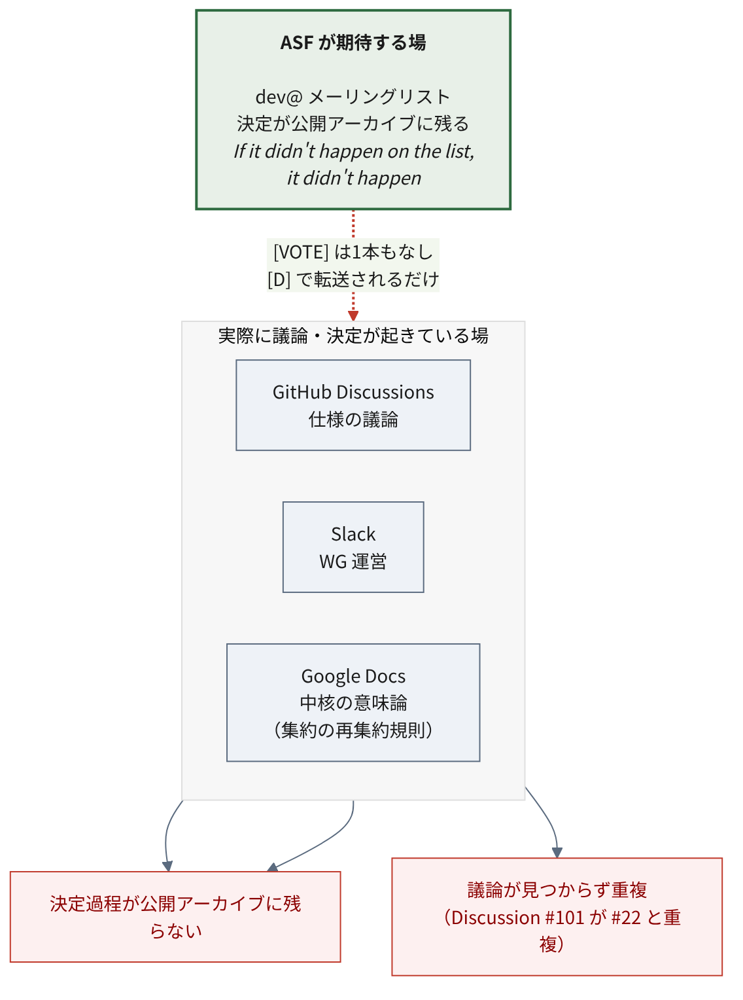

# ASF移管とガバナンス {#sec-governance}

各社のブログは「ベンダー中立になった」と書く。
本章はそれが実態としてどこまで成立しているかを、ASF の一次情報で確かめる。

主な参照先は
[podling status page](https://incubator.apache.org/projects/ossie.html)、
[Clutch](https://incubator.apache.org/clutch/ossie.html)、
[incubation proposal](https://cwiki.apache.org/confluence/display/INCUBATOR/OssieProposal)、
[dev@ アーカイブ](https://lists.apache.org/list.html?dev@ossie.apache.org)、
[general@incubator アーカイブ](https://lists.apache.org/list.html?general@incubator.apache.org)。
アクセス日はいずれも 2026-07-19。

結論を先に書く。**構造としては本物、実態はまだ偏在**。
「ベンダー中立な運営体制の**入口に立った**」が正確である。

## 移管の経緯

| 項目 | 内容 |
| --- | --- |
| Incubator 入り | 2026年6月（ASF 資料で日付が揺れる。後述） |
| Champion | JB Onofré（proposal 記載時は Dremio） |
| Mentors | JB Onofré / Holden Karau / Zili Chen / Russell Spitzer |
| 初期コミッター（proposal の候補） | 14名（PPMC 5＋committer 9。実際に権限を持つ人数は別。後述） |
| リポジトリ | `apache/ossie`（作成は 2025-11-18） |

::: {.callout-note}
## 入り日は ASF 資料内でも揺れている

Incubator 入りの日付は一次資料の中でも一致しない。Clutch のステータスは
`Started: 2026-06-19` とする一方、同じ Clutch の News 欄は
`2026-06-22 Project enters incubation.` とする[^startdate]。本レポートでは
おおむね **2026年6月下旬** として扱い、日付そのものを論拠にはしない。

[^startdate]: Apache Incubator, "[Clutch: ossie](https://incubator.apache.org/clutch/ossie.html)"（"Started: 2026-06-19" と "2026-06-22 Project enters incubation." が併存）、アクセス日 2026-07-21
:::

受入手続きは正規に踏まれている。

- [`[PROPOSAL] Ossie, a data semantic specification and framework`](https://lists.apache.org/thread/3tpx9ynmwonmpm6g76g2vr4zl7cf1hx1) — 2026-06-11
- [`[VOTE] Accept Ossie into the Apache Incubator`](https://lists.apache.org/thread/mytp5k22lxnvg8yysnv3ksm54knmxj1w) — 2026-06-16
- `[RESULT][VOTE]` — 2026-06-18

投票結果は **binding +1 が6票**（Tison, PJ Fanning, Russell Spitzer, Markus Weimer,
JB Onofré, Larry McCay）、non-binding +1 が2票。

### 受入時のレビューで、確認できたライセンス指摘が1件

投票の議論中、IPMC メンバーの PJ Fanning がライセンスの件を指摘している[^ccby]。

[^ccby]: PJ Fanning, "Re: [VOTE] Accept Ossie into the Apache Incubator", general@incubator.apache.org, 2026-06-16 13:50:42. [permalink](https://lists.apache.org/thread/js40nffkgjtyw5nt9d82jnz1mvc07798)（アクセス日 2026-07-19）

> Probably not a big issue but the OSI GitHub repo mentions CC-BY license.
> But ASF license docs have reservations about this license.
>
> （大した問題ではないと思うが、OSI の GitHub リポジトリは CC-BY ライセンスに
> 言及している。ASF のライセンス関連文書はこのライセンスに留保を置いている。）

指摘のトーンは穏当で、「おそらく大した問題ではないが」と前置きされている。
続いて tison が ASF の [Legal Resolved](https://www.apache.org/legal/resolved.html) を示し、
CC-BY コンテンツをソース形式で含めることへの制限を説明した。

対応は同日中に行われた。Russell Spitzer が
**PR #157「Relicense Documentation to ASF 2.0」**を起票し、
2026-06-16 19:19 UTC にマージされている[^pr157]。
PR 本文は、この変更が受入投票で提起されたライセンス上の懸念に対応するものだと述べる。
ただし PR のマージが示すのは**表示上のライセンス変更**であって、
権利処理や全著作者の同意といった IP clearance 全体の完了までは、これだけでは確認できない。
投票スレッド上では、この後に追加の異議は確認していない。

[^pr157]: open-semantic-interchange/OSI, "[PR #157: Relicense Documentation to ASF 2.0](https://github.com/open-semantic-interchange/OSI/pull/157)", merged 2026-06-16。アクセス日 2026-07-19

指摘から解消まで約5時間半。
受入プロセスに外部のレビューが挟まっていることの確認にはなる。
ただし指摘自体は軽微なもので、修正を起票した Russell Spitzer は
Snowflake 所属かつ Ossie の mentor でもある。

### インフラ立ち上げの経過

podling status page に記録されている日付は以下のとおり[^infra]。

[^infra]: Apache Incubator, "[Apache Ossie podling status page](https://incubator.apache.org/projects/ossie.html)" の Incubation Work 節。アクセス日 2026-07-19

| 日付 | 出来事 |
| --- | --- |
| 2026-06-22 | incubation 入り |
| 2026-06-23 | DNS 申請 |
| 2026-06-26 | ML 開設 / git リポジトリ移管 / issue tracker 設定 |
| 2026-06-29 | mentor アクセス付与 |
| 2026-07-08 | dev@ で最初の実質投稿 |

incubation 入りから4日で主要インフラが揃っている。
**他の podling と比較していないため「速い」とまでは言えない**が、
少なくとも立ち上げが滞っている様子はない。

なお podling status page の Mailing Lists 欄は
「dev@, private@, commits@, issues@ **polaris**.apache.org」となっており、
ドメイン名が Apache Polaris のものになっている。
テンプレートの流用時の修正漏れと思われる。

## リリースと卒業の現状

### Apache Release はゼロ

@sec-situation で述べたとおり、**Apache Release は1本も出ていない**。
Clutch ページは "No releases" かつ **"No PGP Signing Keys"** を示す（収集日 2026-07-07 UTC 表示）。
署名鍵はリリース準備の中で登録できるので「鍵がない＝直近で出せない」とまでは言えないが、
少なくとも公開リリースへ向けた外形的な準備の痕跡は、現時点で確認できない。

dev@ のアーカイブにも、リリース計画に関する議論は見当たらなかった[^norelplan]。

[^norelplan]: 2026-07-19 時点で dev@ossie.apache.org に存在する全28通の件名を確認し、`release` / `vote` / `rc` を含むものを探した結果による。不在の証明であり、本質的に弱い主張である点に留意されたい。私信や Slack での検討までは把握できない

### 卒業までの距離

新規 podling は、**最初の3か月は毎月、その後は四半期ごとに報告する**義務がある[^cadence]。
Ossie は6月下旬に受け入れられたため、この月次報告の対象になる。

[^cadence]: Apache Incubator, "[Incubation Policy — Podling Reporting](https://incubator.apache.org/policy/incubation.html)"（"Podlings SHALL report monthly for their first three months, after that quarterly."）、アクセス日 2026-07-21

実際の状況を追うと、**2026年7月の Incubator report で Ossie は
「新規 podling」として記載されるにとどまり、詳細報告は提出していない**[^julyreport]。
受入が直近すぎたためで、"failed to report" 扱いでもない。
最初の実質的なステータス報告は、通常なら8月の月次報告になる。

[^julyreport]: Apache Incubator, "[July 2026 report](https://cwiki.apache.org/confluence/display/INCUBATOR/July2026)"（"A new podling, Ossie … was accepted into the Incubator"。詳細報告のあった podling は Caldera, Casbin, Fluss, PonyMail, ResilientDB）、アクセス日 2026-07-21

したがって「初回報告まで何もない」のではなく、**今後の月次報告が
最初の外部評価の機会**になる。8月・9月の報告に、mentor の応答性・
PPMC の自己評価・リリース計画が現れるかを見るのが有効である。

Clutch が挙げる未充足項目は次のとおり[^clutch]。

- ドキュメント用 wiki の未整備
- podling website の未整備（`ossie.apache.org` は稼働しているが、
  Clutch の基準を満たしていないと判定されている。理由は未確認）
- **release distribution area の未設定**

[^clutch]: Apache Incubator, "[Clutch: ossie](https://incubator.apache.org/clutch/ossie.html)"、収集日 2026-07-07 UTC 表示。アクセス日 2026-07-21

卒業の判断は、固定した期間や報告回数で決まるものではなく、
コミュニティの多様性、ASF 流の意思決定の定着、
**Apache Release を作成・公開できる能力の実証**、IP clearance の完了、
そして最終的にコミュニティ投票・IPMC の推薦・理事会の承認による[^grad]。

[^grad]: Apache Incubator, "[Guide to Successful Graduation](https://incubator.apache.org/guides/graduation.html)" / "[Release Management](https://incubator.apache.org/guides/releasemanagement.html)"。アクセス日 2026-07-21

現時点の Ossie は、Apache Release がなく（@sec-situation）、
release distribution area も未設定で、ML 上で追跡できる合意・投票の実績も乏しい。
**卒業の時期は予測できない**が、少なくとも現状は
リリース能力・意思決定の定着といった実績がまだ積み上がっていない段階である。
参考までに、ASF は典型的な incubation 期間を約1.5年としている[^incperiod]。

[^incperiod]: Apache Incubator, "[トップページ](https://incubator.apache.org/)"。アクセス日 2026-07-21

## 意思決定はどこで行われているか {#sec-governance-decisions}

### dev@ の稼働実態

dev@ossie.apache.org のメッセージ総数は **28通**（2026-07-19 時点）[^mlstats]。
リスト開設は 2026-06-26、実質的な最初の投稿は 2026-07-08。
**稼働してまだ約2週間**である。

[^mlstats]: `lists.apache.org` の統計 API（`stats.lua?list=dev&domain=ossie.apache.org&d=lte=3M`）による。アクセス日 2026-07-19。個々のスレッドは同アーカイブから辿れる

立っているスレッドは、アナウンス、運営提案、参加表明、技術議論、
そして GitHub Discussions からの転送に分かれる。
投稿数上位は JB Onofré 6通、Yong Zheng 6通、Will Pugh 3通。

複数社が絡む議論にはなっている。
"Inconsistent projects/modules managements" スレッドには
Emil Sadek（columnar.tech）、Khushboo Bhatia、Aniket Kulkarni（dremio.com）が返信している。

### 仕様変更の [VOTE] は一度も実行されていない

podling サイトは "a formal discussion-and-vote process for spec changes"
（仕様変更に関する正式な議論と投票のプロセス）を掲げる。
しかし **dev@ 上に仕様変更の [VOTE] スレッドは1本も存在しない。**

唯一 `[PROPOSAL]` が付いているのはコミュニティミーティングの開催時刻の件であり、
仕様の変更に関するものではない。

実際の仕様議論は **GitHub Discussions で行われ、`[D]` プレフィックス付きで
dev@ に転送されている**にとどまる。

ASF が求める「決定は ML 上で行う（If it didn't happen on the list, it didn't happen）」
という規範から見ると、**議論の重心はまだ GitHub 側にある**。
これは incubation 初期の podling によくある状態であり、
mentor から是正が入る典型ポイントでもある。

### GitHub Discussions からも決定が抜けている

**中核的な意味論が Google Docs と Slack に置かれている。**
集約の再集約規則という、仕様の根幹に関わる内容が Google Doc にあり、
Apache リポジトリに存在しない。

議論の所在が分散していることの一例として、
オントロジー層の追加という近い主題が、別々の Discussion に立っている。
2026-01-15 の #22「relational ontologies にもとづくモデル交換」と、
2026-04-06 の #101「オントロジー層のサポート」である[^dupdisc]。
両者が同じ論点を重複して扱っているように見える一方、
**後発の #101 が先行の #22 を「重複」と認識した形跡は、公開情報では確認できない**。
情報分散が原因で重複したのか、単に並行して提案されたのかは断定できないが、
関連する提案が複数の場所に散らばること自体は観測できる。

[^dupdisc]: apache/ossie [Discussion #22](https://github.com/apache/ossie/discussions/22)（2026-01-15）および [Discussion #101](https://github.com/apache/ossie/discussions/101)（2026-04-06）。いずれもオントロジー層の追加を扱う。#101 のコメントに #22 への参照・重複の指摘は見当たらない。アクセス日 2026-07-21

ワーキンググループも Slack チャンネル単位で運営されている（@sec-situation）。

{#fig-decision-venues}

::: {.callout-warning}
## ASF に移管した意味が問われる部分

ML では決めず、GitHub Discussions で議論し、
実質的な決定は Slack と Google Docs にある——という構図になっている。

ASF のガバナンスが提供する価値の中核は「決定過程が公開アーカイブに残ること」である。
その点で、ML 上に追跡できる合意・投票の実績はまだ乏しく、
ASF 流のプロセスが定着したとは言いにくい。ただし ML への転送や
公開 GitHub Discussion は使われており、完全に機能していないわけではない。

なお ML アーカイブ自体にも不備があり、プロジェクト側も Issue #193 で認識している。
:::

## ベンダー中立性の実態

### PPMC の構成

incubation proposal では PPMC 5名と committer 9名に分かれており、
**所属が明記されているのは PPMC 5名のみ**である。

| PPMC | 所属（proposal 記載） |
| --- | --- |
| Khushboo Bhatia | Snowflake |
| Lior Ebel | Salesforce |
| Quigley Malcolm | dbt Labs |
| JB Onofré | Dremio |
| Russell Spitzer | Snowflake |

この **proposal 時点の PPMC 候補5名のうち2名が Snowflake** である。
ただしこれは proposal の候補構成であって、現時点の PPMC 全体ではない
（後述のとおり、実際に権限を持つ人数は Clutch 上4名にとどまる）。

残り9名は proposal 上で所属が明示されていない。これ自体が透明性の観点で弱点になる。

### コミットログから見える実態

`sfc-gh-` プレフィックスは Snowflake 社員アカウントの命名規則である。

コミット数の上位は次のとおり。

| 貢献者 | 所属 | commit 数 |
| --- | --- | --- |
| Khushboo Bhatia | Snowflake | 20（gmail 16 + snowflake.com 4） |
| Kurt Stirewalt | RelationalAI | 15 |
| Baruch Oxman | Honeydew | 15 |
| JB Onofré | Apache | 9 |
| Ralf Becher | 個人 | 6 |
| Emil Sadek | columnar.tech | 8 |
| Quigley Malcolm | dbt Labs | 4 |

出典は GitHub API（`repos/apache/ossie/contributors` および `repos/apache/ossie/commits`）。
所属はコミットのメールドメインによる推定を含む。アクセス日 2026-07-19。
`sfc-gh-` プレフィックスが Snowflake 社員の命名規則である点は
[Snowflake のブログ著者ページ](https://www.snowflake.com/en/blog/authors/will-pugh/)で裏を取った。

Snowflake が単独最大ではある。しかし
**RelationalAI と Honeydew の個人がそれぞれ Snowflake 主力とほぼ同等の commit 数**を
出しており、「Snowflake のワンマンプロジェクト」とまでは言えない。

なお `karanasher`（19 commits、contributor 3位）は committer リストに載っていない。
所属も未確認である。

### proposal 自身が偏重を認めている

Ossie の incubation proposal は、Known Risks の節でこう書いている[^proposal]。

[^proposal]: Apache Incubator, "[Ossie Proposal](https://cwiki.apache.org/confluence/display/INCUBATOR/OssieProposal)", アクセス日 2026-07-19。和訳は筆者による

**Homogeneous Developers（開発者の同質性）**

> the contributor base is currently concentrated across three organizations.
> We view diversification as a critical incubation goal, not a stretch objective.
>
> （貢献者の基盤は現在、3つの組織に集中している。
> 我々は多様化を、努力目標ではなくインキュベーションの重要な達成目標と位置づける。）

対処として、good first issue のバックログ整備、オンボーディング・ワークショップ、
コントリビュータ・スプリントの実施を挙げ、
創設組織の外からの参加者を積極的に募るとしている。

**Reliance on Salaried Developers（有給開発者への依存）**

> While most of the contributors are affiliated with Snowflake, Dremio, dbt Labs,
> Salesforce, the commitments to open source ensure a genuine commitment to the
> Apache Way and open source principles.
>
> （貢献者の多くは Snowflake、Dremio、dbt Labs、Salesforce に所属しているが、
> オープンソースへのコミットメントが、Apache Way と
> オープンソースの原則への真摯な取り組みを担保する。）

エコシステムが成熟し他組織が実装を作るにつれ、
創設企業の被雇用者を超えて貢献者が自然に多様化すると見込む、としている。

**各社ブログの「ベンダー中立になった」という表現と比べると、
proposal 本文のほうが現状を率直に記述している。**

なお proposal は meritocracy についてこう述べる。

> contributors earn merit through sustained work of any kind and committership is
> earned by demonstrated contribution rather than employer
>
> （貢献者はあらゆる種類の継続的な作業を通じて信任を得る。
> コミッター権は、雇用主ではなく実証された貢献によって得られる。）

これは**方針の宣言であって現状の描写ではない**点に注意が要る。

同じ proposal は、仕様変更について
**最低7日間の議論期間と +1 / 0 / -1 の投票**を要すると定めている。
この手続きが実際に使われた記録は、2026年7月時点で確認できていない（前節）。

### Clutch と status page の食い違い

Clutch は committers 4名（全員 PPMC）と表示する一方、
podling status page は14名を挙げる。

Clutch が committers を4名と数える一方、status page は14名を挙げる。
14名は proposal 上の「予定された初期コミッター」であり、
実際に権限を持つのはその一部、という読みはできる。
ただし Clutch の4名が正確に何を数えているか（LDAP アカウント作成済みか、
実際の commit 権限保有者か)は一次資料から確定できない。**推定にとどまる**。

## 移管の前後で活動量は増えたか

移管後に活動量は増えている。ただし変動値のスナップショットであり、
移管が原因で加速したという因果までは、この数字だけでは言えない。

以下は **2026-07-19 時点**の GitHub API の値である（日次で変わる）。

| 指標 | 値（2026-07-19 時点） |
| --- | --- |
| merged PR 累計 | 68 |
| **うち 2026年6月下旬以降** | **32** |
| 6月下旬以降の commit | 52 |
| リポジトリ star | 1,342 |

出典は GitHub API（`search/issues?q=repo:apache/ossie+type:pr+is:merged` および
`repos/apache/ossie`）。アクセス日 2026-07-19。数値は集計方法（merge 方式・
共同著者・メール統合)で変わりうる。移管日（6/19 か 6/22 か）で前後区分も動く。

約7ヶ月（2025-11 〜 移管前）で merged PR 36本に対し、移管後の約4週間で32本。
活動量が増えたのは確かだが、次の理由で「移管が加速させた」とは断定できない。

- 4週間という観測窓は短く、**アナウンス直後の一時的な効果と持続的な傾向を区別できない**
- ASF 移管に伴う機械的変更（LICENSE/NOTICE 追加、ヘッダ付与、CI 再構成、
  ライセンス変更作業）が PR 数を押し上げている可能性がある。**内訳は未確認**

定性的には、dev@ 開設からの2週間で committer リストにない人物からの
参加表明が複数あり、**ASF ブランドが新規参加の敷居を下げた**兆候はある。

## 中立性をどう判定すべきか

「ベンダー中立になった」が妥当かは、宣言ではなく実績で判定すべきである。
以下の3点が指標になる。

1. **仕様変更の VOTE で、所属に関係なく反対意見が検討され、
   理由付きの合意が公開の場に記録されるか**
2. **創設企業以外からの committer 昇格が起きるか**
3. **初回 Apache Release を IPMC 投票で通せるか**

いずれも 2026-07-19 時点では未達である。
