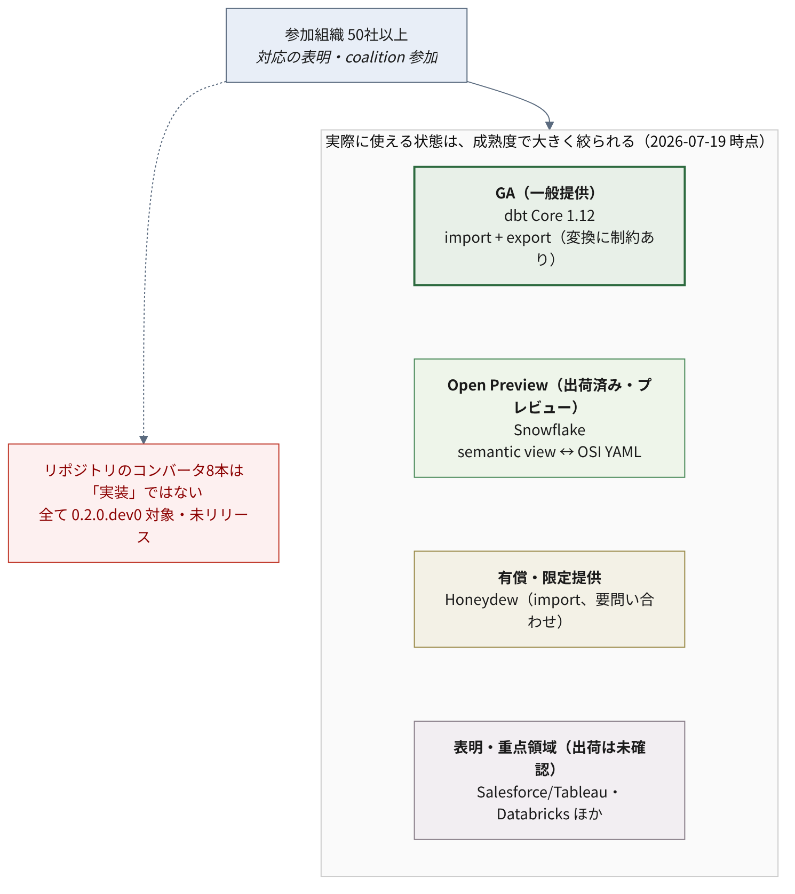

# エコシステムの現状 {#sec-ecosystem}

「参加50社超」という数字が独り歩きしている。
本章では、それが実装状況としてどこまで裏付けられるかを、2026-07-19 時点で調べる。

::: {.callout-note}
## 本章の数値はスナップショットである

参加社数・実装状況・各種の日付は、この分野では短期間で動く。
以下は **2026-07-19 時点**の確認にもとづく。GitHub の状態を指す箇所は
コミットや PR 番号を併記し、変わりうる値であることを明示する。
:::

## 参加と実装の落差

参加組織は50社を超える[^orgs]。一方、それを製品として使える状態にした実装は、
**成熟度に大きな幅がある**。「対応を表明した」ことと「今すぐ使える」ことは別なので、
段階を分けて数える。

| 段階 | 意味 | 該当（2026-07-19 時点で確認できたもの） |
| --- | --- | --- |
| GA | 一般提供 | dbt Core 1.12（import + export、2026-07-16 GA。※変換に制約あり）[^dbt] |
| Open Preview | 出荷済みだがプレビュー | Snowflake（semantic view ↔ OSI YAML、2026年6月導入）[^sf] |
| 有償・限定提供 | 公開情報が乏しい | Honeydew（import 方向、要問い合わせ）[^honeydew] |
| 表明・重点領域 | 出荷は未確認 | Salesforce/Tableau（OSI を co-lead、双方向交換を重点）[^sfdc]、Databricks（"OSI ready" と表明）[^dbx-summit] |

{#fig-adoption-gap}

**今すぐ本番で使える実装は依然として少ない。** GA は dbt Core 1.12 の1件、
Snowflake は Open Preview（後述)にとどまる。
「参加50社」と「実際に動くもの」の落差は大きいが、
その落差は成熟度の段階に分けて測る必要がある。

[^orgs]: Apache Ossie, "[Apache Ossie (Incubating): The New Name for Open Semantic Interchange](https://ossie.apache.org/updates/ossie-enters-apache-incubator/)", アクセス日 2026-07-19。創設17社から50社超へ拡大した旨の記載による。「参加」は coalition の自己申告的な集計であり、実装企業数ではない。
[^dbt]: [dbt docs: OSI semantic models](https://docs.getdbt.com/docs/build/osi-semantic-models)、アクセス日 2026-07-19。1.12.0 は 2026-07-16 公開（[PyPI](https://pypi.org/project/dbt-core/)）。export は未対応構文を落として警告する制約がある。
[^honeydew]: Honeydew は有償製品で、対応の詳細は要問い合わせ。公開ドキュメントからは import 方向・提供形態・対応バージョンを十分に裏付けられなかった。アクセス日 2026-07-19

各段階の確認手段と参照文献は @sec-method に整理してある。

### リポジトリ内のコンバータ8本は実装ではない

仕様リポジトリの `converters/` には8本のコンバータがある。

`dbt` / `gooddata` / `honeydew` / `omni` / `orionbelt` / `polaris` / `salesforce` / `snowflake`

これを「8社が実装済み」と読むのは誤りである。

- いずれも**未リリース**。PyPI に公開されていないものもある
- **全8本が `0.2.0.dev0` を対象**としており、出荷版 dbt が受理しないバージョンである
- そもそも**公式コンバータの出力が公式バリデータを通らない**ものがある（@sec-verification-roundtrip）

`orionbelt` は BlackRock のものと誤解されやすいが、
**独立した開発者 Ralf Becher による OBML（OrionBelt Markup Language）**である[^obml]。
`polaris` は Apache Polaris（Iceberg カタログ）を指す。

[^obml]: 正典は [ralfbecher/orionbelt-semantic-layer](https://github.com/ralfbecher/orionbelt-semantic-layer)、PyPI パッケージ名は `orionbelt-semantic-layer`。アクセス日 2026-07-19

### 主要ベンダーの状況

主要ベンダーを OSI 対応の観点で個別に見ると、出荷段階に差がある。

- **Snowflake**: semantic view を OSI YAML として書き出す／OSI YAML から
  semantic view を作る機能を **Open Preview** で提供している（2026年6月導入）。
  公式の preview features に
  「Open Semantic Interchange (OSI) YAML format for semantic views」として掲載され、
  関数 `SYSTEM$CREATE_SEMANTIC_VIEW_FROM_OSI_YAML` が挙がっている[^sf]。
  GA ではなく Open Preview である点に注意
- **Salesforce / Tableau**: OSI を co-lead し、「metrics・dimensions・hierarchies・
  relationships の双方向のメタデータ交換」を初期の重点に挙げている[^sfdc]。
  ただし記述は将来形・方針表明が中心で、**出荷済みの製品機能としては確認できなかった**
  （該当ヘルプページの本文は取得できず)。Ossie リポジトリには双方向変換器があるが、
  jar は `0.1.0-SNAPSHOT` で、これ自体は製品機能ではない
- **Databricks**: 製品ドキュメント（metric views と YAML リファレンス）に
  OSI import/export の手順は確認できなかった[^dbx]。一方、Data + AI Summit 2026 の
  自社ブログでは metric views を "Open Semantic Interchange (OSI) ready" と述べている[^dbx-summit]。
  何をもって ready とするかは示されておらず、**互換機能の範囲と利用手順は未文書化**である
- **Dremio**: Dremio Cloud の changelog（2025-11-12 〜 2026-07-14 の範囲）に該当なし。
  製品側の記載は確認できず、自社ブログで Ossie に言及するにとどまる[^dremio]
- **Cube**: ブログで「オープンアダプタを提供する」と表明してから約10か月経つが、
  製品ドキュメントにも Ossie リポジトリにも成果物が見当たらない[^cube]

::: {.callout-note}
## 「確認できなかった」は不在の証明であって存在しないことの証明ではない

上記の否定的な判定（Dremio・Cube・Databricks の import/export 未文書化など）は、
調べた範囲での不在であって、本質的に弱い。参照文献と調査範囲は @sec-method に列挙した。
公開情報でも、プレビュー機能などは掲載場所によって見つけにくいことがある。
NDA 下のプライベートプレビューは公開情報に現れない。
:::

[^sf]: Snowflake, "[Preview features](https://docs.snowflake.com/en/release-notes/preview-features)"（"Open Semantic Interchange (OSI) YAML format for semantic views"、Open Preview、2026年6月）、アクセス日 2026-07-21。関数は [SQL functions index](https://docs.snowflake.com/en/sql-reference/functions-all) 参照
[^dbx]: [metric views](https://docs.databricks.com/aws/en/business-semantics/metric-views) / [YAML reference](https://docs.databricks.com/aws/en/business-semantics/metric-views/yaml-reference)、アクセス日 2026-07-19
[^dbx-summit]: Databricks, "[What's new with Unity Catalog at Data + AI Summit 2026](https://www.databricks.com/blog/whats-new-unity-catalog-data-ai-summit-2026)", アクセス日 2026-07-20。原文は "Metrics is also open: it's open source, available in Apache Spark and Unity Catalog OSS, and its Open Semantic Interchange (OSI) ready."。和訳は筆者による
[^dremio]: [Dremio Cloud changelog](https://docs.dremio.com/dremio-cloud/changelog/) / [Dremio ブログ](https://www.dremio.com/blog/apache-ossie-incubating-the-new-name-for-open-semantic-interchange/)、アクセス日 2026-07-19
[^cube]: [Cube: semantic layer sync](https://docs.cube.dev/docs/integrations/semantic-layer-sync)、アクセス日 2026-07-19
[^sfdc]: Salesforce, "[Ending Semantic Drift](https://www.salesforce.com/blog/ending-semantic-drift-unified-business-logic-foundation/)" ほか。Tableau Semantics の重点として bi-directional metadata exchange を挙げる。Ossie リポジトリの [converters/salesforce](https://github.com/apache/ossie/tree/main/converters/salesforce)（jar `0.1.0-SNAPSHOT`）も参照。アクセス日 2026-07-21

## カタログ製品3社の状況

Atlan・Alation・Select Star はいずれもローンチパートナーとして名を連ねているが、
**いずれも動く実装を確認できなかった**。

この3社についてはドキュメント全体を機械的に走査したため、
前節の5社より否定の確度が高い（走査対象と規模は @sec-method）。
検索語 `osi` / `ossie` / `open semantic interchange` に対するヒットは3社とも実質0件で、
`apache/ossie` のコミット履歴にも3社のドメインからの貢献は存在しない。

### 出荷されている機能は Snowflake 固有形式に対応するもの

3社が現に提供している機能を見ると、対応先が揃っている。

- **Atlan**: Context Engineering Studio（Private Preview）。
  独自形式を各ターゲットへ射影する設計で、Snowflake へのデプロイ先は
  **Snowflake Semantic View** である[^atlan-ces]
- **Alation**: 「Data Products App が Snowflake semantic views と双方向連携」
  「Extract Semantic Views from Snowflake (Beta)」[^alation-rel]
- **Select Star**: セマンティックモデル YAML は
  **「Snowflake Cortex Analyst specification」準拠**と明記[^ss-docs]

[^atlan-ces]: Atlan, "[Deploy to Snowflake（Context Engineering Studio）](https://docs.atlan.com/product/capabilities/governance/context-engineering-studio/how-tos/deploy-snowflake)", アクセス日 2026-07-19
[^alation-rel]: Alation の2026年リリースノート（`docs.alation.com/en/latest/releases/releasenotes/`）より。走査の範囲は @sec-method
[^ss-docs]: Select Star, "[Semantic Models](https://docs.selectstar.com/)" のドキュメント全文より。走査の範囲は @sec-method

3社とも、接続先は Snowflake の semantic view または Cortex Analyst であり、
ベンダー中立の交換形式を介してはいない。

これは各社の姿勢というより、**市場の順序として理解できる**。
Snowflake は semantic view を実際に出荷しており、
そこに接続すれば顧客の需要に今すぐ応えられる。
一方 Ossie は @sec-situation で見たとおりリリース版すら固まっておらず、
対応先として選びにくい。すぐ使える実装が乏しい理由も同じところにある。

ただし「市場は Snowflake 固有形式への個別対応だけ」と一般化はできない。
反対材料として、Databricks は自社ブログで Atlan・Collibra・Monte Carlo・Domo・
Hex・Omni などとの連携（出荷済み・計画中を含む)を挙げている[^dbx-partners]。
Snowflake を軸にした個別対応が目立つのは確かだが、Databricks 側の
セマンティック層を軸にした連携群も並行して存在する。

そのうえで言えるのは、**Ossie が解こうとしている「ベンダー中立の交換形式を介した
相互運用」は、現場ではまだ主流になっておらず、各ベンダー固有形式への
個別対応が先行している**ということである。

[^dbx-partners]: Databricks, "[Redefining Semantics](https://www.databricks.com/blog/redefining-semantics-data-layer-future-bi-and-ai)" の partner ecosystem 記載より。アクセス日 2026-07-21

### 発信の時制には幅がある

各社の発信を並べると、OSI をどの時点の話として語るかに違いがある。

Select Star は自社ブログで将来形を使う[^ss-blog]。

> so they can travel across tools **as OSI matures**
>
> （OSI が成熟するにつれて、それらがツール間を行き来できるように）

Atlan の解説記事は現在形である[^atlan-seo]。

> This portability is backed by the Open Semantic Interchange (OSI) standard
>
> （この可搬性は Open Semantic Interchange (OSI) 標準に支えられている）

Databricks の Summit ブログの "OSI ready" も、
準備状態を指すのか出荷済みの機能を指すのか、文面からは判別できない。

**標準への賛同・準備・実装は、それぞれ別の段階である。**
発信の場（解説記事・イベント登壇・製品ドキュメント）によって
どの段階を語っているかが変わるため、読み分けが要る。

[^ss-blog]: Select Star, "[Snowflake AI-Ready Semantic Model](https://www.selectstar.com/resources/snowflake-ai-ready-semantic-model)", アクセス日 2026-07-19。和訳は筆者による
[^atlan-seo]: Atlan, "[Context Catalog](https://atlan.com/know/context-catalog/)", アクセス日 2026-07-19。製品ドキュメントではなく解説記事。和訳は筆者による

::: {.callout-note}
## この分野の情報を読むときの実務的な指針

導入判断のために「今それが使えるか」を知りたいときは、
**製品ドキュメントとリリースノートを見るのが確実**である。
プレスリリース・パートナー一覧・解説記事は、
方向性の表明としては有用だが、出荷状況の証拠にはならない。

本章の否定的な判断は、製品ドキュメントの探索と
`apache/ossie` のコミット履歴という2経路で確認している。
ただしこれは不在の証明であり、本質的に弱い。
調査範囲と限界は @sec-method に明示した。
:::

## Superset の SIP-182 は OSI 対応ではない

Apache Superset の SIP-182「Semantic Layer Support」は
2026-06-22 に completed としてクローズし、約26本の PR が master にマージされている[^sip182]。

[^sip182]: apache/superset, "[[SIP-182] Semantic Layer Support in Apache Superset](https://github.com/apache/superset/issues/35003)", アクセス日 2026-07-19

ただし2点、注意が要る（確認手段は @sec-method-superset）。

- **未リリース**。`superset/semantic_layers/` は 6.2 リリースブランチに存在せず、
  master 上のフラグは `"SEMANTIC_LAYERS": False`（`# @lifecycle: development`）
- **OSI 対応ではない**。`apache/superset` を検索しても
  `ossie` / `open semantic interchange` は 0件で、
  `apache/ossie` 側にも Superset コンバータはない。
  SIP-182 はセマンティック層一般の基盤であって、OSI の実装ではない

Preset は「Preset と Superset の双方で OSI 形式の export / import を
できるようにする作業を進めている」と表明しているが、未来形で日付もない。

## 意味をどこに置くか — Unity Catalog との対比 {#sec-uc-comparison}

**セマンティック層をどこに実装するかについて、2つの異なる賭け方が並走している。**
一方は自社カタログの内側に作り込み、他方は中立仕様を格納する器として作る。
前者は既に GA し、後者はまだ動いていない。

Databricks の Unity Catalog Business Semantics は **2026-04-02 に GA** している[^dbx-blog]。
ただし GA は中核機能（metric views)についてで、materialization や UI authoring など
一部は Preview である。「GA」を全機能一律と読まないほうがよい。

- 中核は「metric views」
- metric view の実装を Apache Spark OSS へオープンソース化中（SPARK-54119）
- Unity Catalog OSS にも `METRIC_VIEW` テーブル型を追加する PR がマージ済み[^uc-pr]。
  ただし**マージはコード上の進展であって、配布リリースへの収録とは別**。
  4/2 発表時点では OSS への対応を "coming soon" としており、現配布版への収録は未確認

[^dbx-blog]: Databricks, "[Redefining Semantics: The Data Layer for the Future of BI and AI](https://www.databricks.com/blog/redefining-semantics-data-layer-future-bi-and-ai)", アクセス日 2026-07-19
[^uc-pr]: unitycatalog/unitycatalog, "[PR #1493: Add METRIC_VIEW table type](https://github.com/unitycatalog/unitycatalog/pull/1493)", アクセス日 2026-07-19

比較にあたって前提を2つ置く。
Ossie は**ツール間でモデルを受け渡す交換フォーマット**、
Unity Catalog Business Semantics は**単一ベンダーのセマンティック層の実装**であり、
層が異なる。また Databricks は Ossie の参加企業でもあり、実際に貢献している。
競合として並べるのではなく、**設計上の選択が分かれた事例**として見る。

違いは、意味の定義をどこに置くかにある。

| | Unity Catalog | Polaris + Ossie |
| --- | --- | --- |
| 置き場所 | metric view を**テーブル型の一種**として既存カタログモデルに組み込む | Ossie 文書を**別エンティティ型**として持つ |
| 状態 | **GA**（2026-04-02、中核機能） | エンドポイントは 501、フラグは default false（固定コミット `07be0176` 時点。日次で変わりうる） |
| 仕様の主体 | 自社仕様で先行出荷、OSI 対応も表明 | 最初から中立仕様を格納 |

読み取れるのは**速度と中立性のトレードオフ**である。

自社仕様なら設計から出荷まで一社の判断で進められる。
中立仕様を待つなら、仕様が固まるまで実装を出せない。
Ossie が @sec-situation で見たとおりリリース版すら確定していない状況では、
後者が遅くなるのは構造的に避けがたい。

したがって「標準化陣営が周回遅れ」と読むのは、比較の仕方として適切でない。
**中立性と速度のどちらを優先したかの違い**と見るほうが実態に近い。

そのうえで問うべきは、中立性のために払った速度のコストに見合うだけの
中立性が実際に得られているかである。
判断材料は @sec-governance と @sec-verification にある。

## カタログ統合はまだ動かない

Ossie と Apache Polaris の連携は、**API の形が決まっただけ**の段階である。

### 実装済みのもの

- `apache/ossie` の Polaris コンバータ（[PR #94](https://github.com/apache/ossie/pull/94)、2026-05-12 マージ）。
  ただし中身は **Iceberg REST Catalog 経由で物理テーブル定義を吸い上げて
  Ossie YAML の雛形を作る**もので、**メトリクス定義は往復しない**。
  実 Polaris への結合テストと往復忠実性の検証は未チェックのままマージされている
- `apache/polaris` の semantic-models **OpenAPI 仕様とエンドポイントの器**
  （[PR #4816](https://github.com/apache/polaris/pull/4816)、2026-07-01 マージ）

### 構想・未実装のもの

以下はいずれも 2026-07-19 時点（`apache/polaris` の当時の main）での確認であり、
日次で変わりうる。

- Polaris の semantic-models エンドポイントは**全メソッドが `501 Not Implemented`**
  （`SemanticModelCatalogAdapter.java` の javadoc に明記）
- フィーチャーフラグ `ENABLE_SEMANTIC_MODELS` は default false
- CRUD 実装 [PR #4961](https://github.com/apache/polaris/pull/4961) は
  2026-07-19 時点で**未マージ**。RBAC 統合もこの PR の中
- **リリース版 Polaris には入っていない**。1.5.0 も 1.6.0（2026-07-09）も
  `extensions/` は `auth` と `federation` のみ
- ROADMAP の "Standalone semantic service / registry" は設計提案すら見つからない

**「Ossie モデルが Polaris から discover できる」はまだ動かない。**

### 設計は理にかなっている

エンドポイントは未実装（後述）だが、設計の考え方には見るべきものがある。

**Polaris は Ossie 文書の中身を読まない。**
`{version, semantic_model}` という JSON 文字列を、
そのまま1個の値として保管するだけである。
中に何のメトリクスが定義されているかも、どんなフィールドがあるかも解釈しない。

これは手抜きではなく、意図的な切り離しである。

もし Polaris が Ossie 文書の中身を理解する作りにすると、
**Ossie の仕様が変わるたびに Polaris のコードを直してリリースし直す必要が出る。**
現状の Ossie は @sec-situation で見たとおりリリース版すら固まっていないので、
これに追随するのは現実的でない。

中身を読まなければ、Ossie が 0.1.1 から 0.2.0 へ、さらにその先へ進んでも、
Polaris 側は何も変えずに保管し続けられる。
**仕様の進化速度とカタログのリリースサイクルを独立させる**ための判断である。

同じ発想は Iceberg にもある。Iceberg のカタログは、テーブルの詳細なメタデータを
自分で持たず、`metadata.json` への**ポインタだけ**を管理する。
実体の解釈はカタログの外に委ねる。Polaris の Ossie の扱いはその延長線上にある。

代償もある。中身を読まない以上、**カタログ側で
「このメトリクスを含むモデルを探す」といった検索はできない**。
保管と受け渡しに徹する設計になる。

なお両者の接点は Ossie の `datasets[].source`（`db.schema.table` 形式）ただ1つで、
参照は Ossie → 物理テーブルの片方向である。
Polaris が Ossie 文書を指すことはあっても、逆はない。

semantic-models はパスを `/polaris/v1/...` に分けて
Iceberg REST Catalog の名前空間を汚さず、能力広告だけ Iceberg の
`Endpoint` / catalog config 機構に乗せている。

一方で ROADMAP が言う "versioning" の実態は限定的である。
Polaris の `EntityVersion` は**楽観的並行制御用の不透明文字列**であり、
履歴取得 API はない。監査用途には答えられない。

### 人的なつながり

Ossie の Champion である JB Onofré は Polaris の中心人物でもあり、
Mentor の Russell Spitzer は Iceberg の中心人物である。
カタログ統合が優先課題に上がっている背景には、この人的配置がある。

### 他のカタログ製品

Apache Gravitino については、OSI / セマンティック層の実装を確認できなかった。
リポジトリの Issue / PR を OSI 関連の語で検索した結果はゼロである。
「Gravitino 上に OSI モデルのレジストリを作る」という趣旨のベンダー記述を
検索結果で見かけたが、一次情報で裏が取れなかった。

Unity Catalog については @sec-uc-comparison で扱う。
