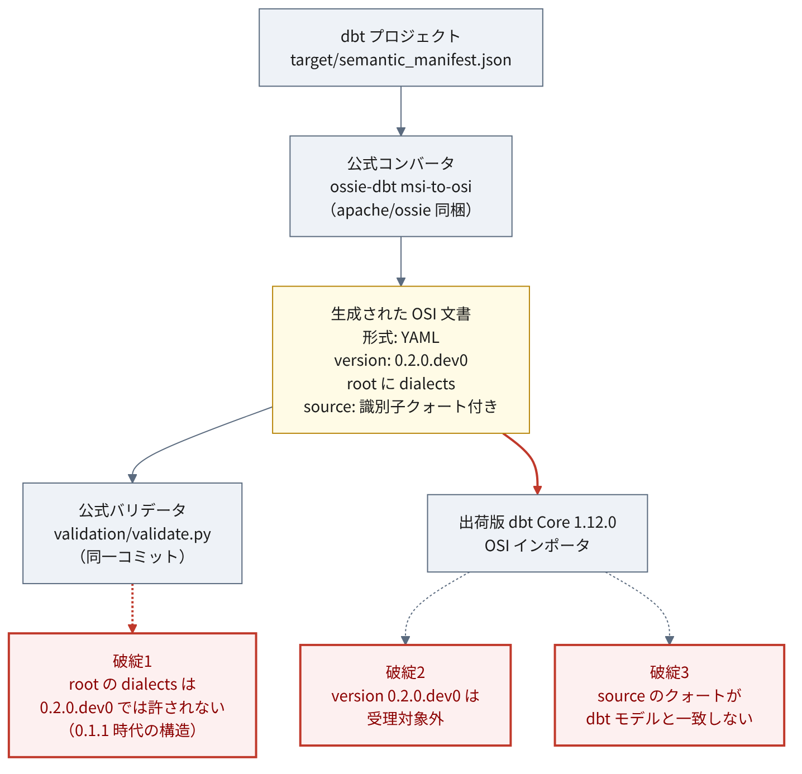
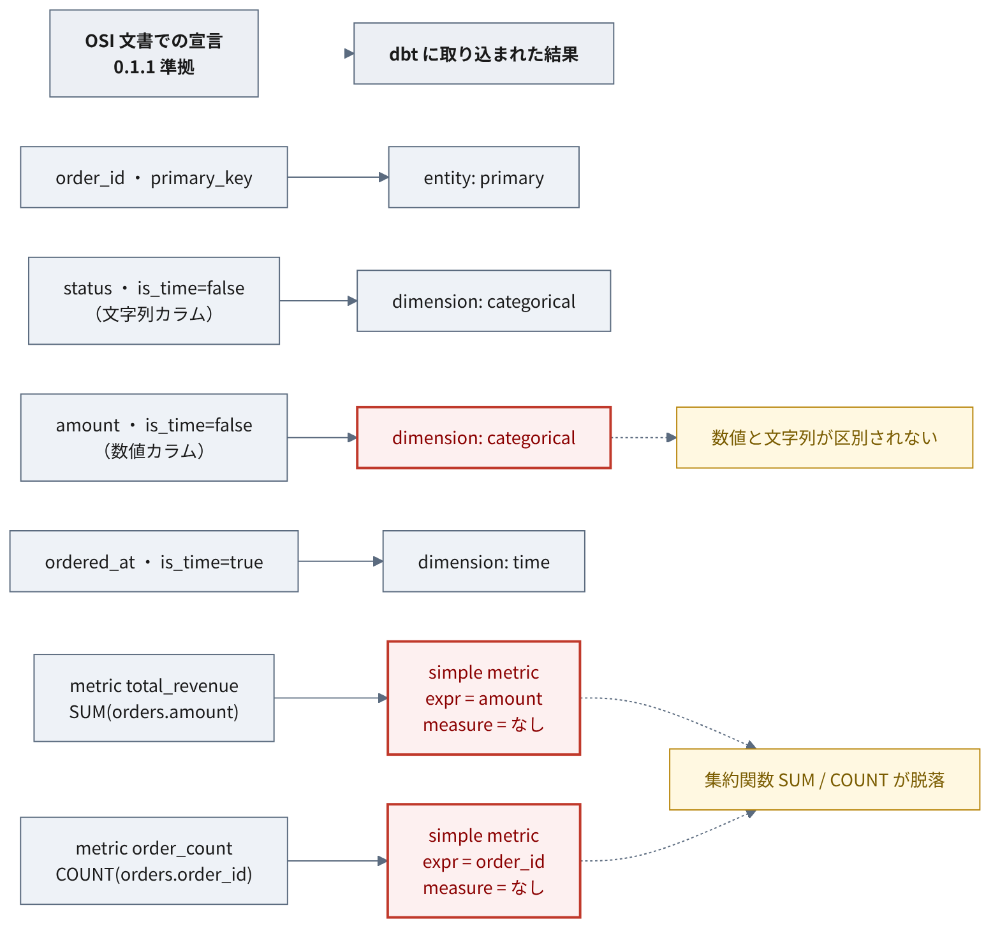

# 動作確認 {#sec-verification}

ここまでは文書の読解である。本章は実際に動かした結果を扱う。

本章の観測はすべて再現可能である。検証スクリプトと実行環境は
[ossie-playground](https://github.com/dobachi/ossie-playground) のルートにあり、
`make verify` で追試できる（@sec-reproduce）。
実行結果の生データはリポジトリの `docs/results/track_a.json` / `track_b.json` に出力される。
検証項目ごとの主張と反証条件は本章で順に示す。

固定の粒度には強弱がある。仕様リポジトリはコミット（`07be0176`）で固定し、
消費側の `dbt-core` / `dbt-duckdb` は `==` で厳密に固定している。
一方でベースイメージ（`python:3.12-slim`）はダイジェスト固定しておらず、
一部の依存はバージョン下限（`>=`）指定で、完全なロックファイルは用意していない。
したがって再ビルドの時期によっては下位依存の版が動きうる。
この固定の限界と、正確な指定（`docker/Dockerfile`・`docker/requirements.txt`・
`Makefile` の `OSSIE_COMMIT`）は @sec-reproduce に記す。

## 検証の設計

### なぜ2トラックに分けたか

@sec-situation で述べたとおり、0.1.1 と 0.2.0.dev0 は
**揃っているツールチェーンが異なる**。同じ手順を両方に適用することはできない。

| | 0.1.1 | 0.2.0.dev0 |
| --- | --- | --- |
| 公式スキーマ | あり（タグ `osi-0.1.1-rc1`） | あり（`main`） |
| 公式サンプル | **なし** | 2本 |
| `converters/` 8本 | 対象外 | **全8本がこちら** |
| 出荷版 dbt Core 1.12 | **受理** | 拒否 |

そこで2つの経路をそれぞれ別に検証した。

**トラックA（0.1.1）** — 手書きの準拠文書 → 公式バリデータ → dbt 取り込み → `dbt run`。
本検証の2トラックの中で、端から端まで通せた唯一の経路である
（他のコンバータや `osi-to-msi` 方向、dbt Fusion 等は検証していない）。
公式サンプルが存在しないため入力は自作せざるを得ない。

**トラックB（0.2.0.dev0）** — 公式コンバータで dbt から生成 → 公式バリデータ → dbt 取り込み。
生成側の経路。

### 運用ルール

検証計画を先に固定し、
各項目について**主張・手順・裏付けとなる観測・反証となる観測**を事前に書いた。

特に重要なルールが1つある。
**投入する文書はすべて公式バリデータを通してから実装に食わせる。**

仕様に適合しない文書を実装に読ませると、実装がそれをどう扱おうと
「実装の性質」としては解釈できない。仕様準拠を先に保証しておかないと、
観測されたものが仕様由来か実装由来かを切り分けられなくなる。

### 環境

| 項目 | 値 |
| --- | --- |
| 仕様 | `apache/ossie` @ `07be0176` / 比較タグ `osi-0.1.1-rc1` |
| 消費側 | dbt Core 1.12.0 / dbt-duckdb 1.10.1 / metricflow 0.211.0 |
| 実行環境 | `python:3.12-slim` コンテナ |

消費側の版は、`dbt-core==1.12.0` を起点に依存範囲から解決された結果であり、
`metricflow` 0.211.0 もその解決で入った版である（明示的に固定して同梱したものではない）。

すべて Docker 上で動かし、ホストには何も入れていない。
必要なのは docker だけである。再現手順は @sec-reproduce。

::: {.callout-note}
## 本章の観測はスナップショット時点のもの

本章の結果は、いずれも固定コミット `07be0176`（2026-07-17）に対するものである。
その後の 2026-07-20、`main` には複数のコミット
（`0.2.0.dev0` のスナップショットファイル追加、Snowflake のクォート付き識別子対応 #233 ほか）が入っている。
これらが後述の往復問題（@sec-verification-roundtrip）を解消したかどうかは**未確認**であり、
本章の観測には反映していない。
:::

::: {.callout-note}
## 検証中は外部ネットワークから切り離している

検証を走らせるコンテナは、Docker の設定（`network_mode: none`）で
**外部と通信できない状態にしてある**。実行中にパッケージを取りに行ったり、
仕様リポジトリを引き直したりできない。

理由は結果の再現性である。実行のたびに外部から何かを取得していると、
**上流が変わった瞬間に結果が変わり、しかもそれに気づけない**。
通信を断てば、結果を左右するのは
固定したコミット（`07be0176`）とコンテナイメージだけになる。

外部を使うのは事前準備の一度だけで、仕様リポジトリを
固定コミットで取得する `make spec` がそれにあたる。
以降の `make verify` は取得済みのものだけを見る。

副次的な効果として、dbt が起動時に最新版を確認しようとして失敗する
（`The latest version of dbt-core could not be determined!`）。
これは切り離しが効いていることの確認にもなる。
:::

## 結果の概要

検証は6項目。各項目は「こうなっているはずだ」という主張を先に立て、
それが観測で裏付けられるか、あるいは覆されるかを見る形で設計した。

| 項目 | 何を確かめたか | 結果 |
| --- | --- | --- |
| V1 | 構造が同じ文書でも、バージョン文字列の違いだけで相互に受け付けられなくなるか | 裏付けられた。加えて別の要因も判明 |
| V2 | 実装は、公式スキーマが禁じている書き方を受け入れてしまうか | 裏付けられた。警告も出ない |
| V3 | 型情報を持たないディメンションを、実装はどう解釈するか | 数値と文字列が区別されなかった |
| V4 | メトリクスの集約式は、実装のモデルへどう写像されるか | 集約関数が脱落。**実行しての確認はできなかった** |
| V5 | 仕様に書かれていない前提が、取り込みに必要になるか | 3件必要だった |
| V6 | 公式コンバータの出力を、出荷版の実装は受け取れるか | 受け取れない。**想定していなかった要因が2つ**あった |

全体として、**主張はおおむね裏付けられた**。ただし V4 は実行環境の制約で
最後まで確認できず、V6 は事前に想定していたのと別の理由でも失敗した。
以下、順に見ていく。

## 本検証構成では dbt を挟んだ往復が成立しない {#sec-verification-roundtrip}

本章で最も紙幅を割く結果である。

仕様リポジトリ同梱の公式コンバータ（`ossie-dbt msi-to-osi`）で
dbt プロジェクトから OSI 文書を生成し、同じ dbt に戻せるかを試した。
以下は固定コミット `07be0176`・dbt-core 1.12.0・本検証の入力に対する観測であり、
製品やアダプタ、現行 `main` を横断する一般命題ではない。

{#fig-roundtrip}

**この構成では、少なくとも3つの要因が重なって往復が成立しなかった。**
以下の3つはそれぞれ別の層で起きており、いずれか1つを直しても残りで止まる。

### 破綻1: 公式コンバータの出力が、同一コミットの公式スキーマで落ちる

```
[Schema] (root): Additional properties are not allowed ('dialects' was unexpected)
```

コンバータはルート直下に `dialects: ["ANSI_SQL"]` を出力する。
これは **0.1.1 のルート構造**であり、0.2.0.dev0 では削除されている（@sec-spec-diff）。

にもかかわらずコンバータは `version: "0.2.0.dev0"` を出力する
（[`converters/dbt/src/ossie_dbt/msi_to_osi.py` L124](https://github.com/apache/ossie/blob/07be0176e48af67f0b46e0957a87a154586abf38/converters/dbt/src/ossie_dbt/msi_to_osi.py#L124) のハードコード。
[`tests/test_msi_to_osi.py`](https://github.com/apache/ossie/blob/07be0176e48af67f0b46e0957a87a154586abf38/converters/dbt/tests/test_msi_to_osi.py) でもこの値がアサートされている）。

つまりコンバータの出力は、**ルート構造は 0.1.1 のまま、`version` 文字列だけ 0.2.0.dev0** という
組み合わせになっている。この文書は、同一コミットの公式バリデータ（0.2.0.dev0 スキーマ）を通らない。

### 破綻2: バージョン文字列で拒否される

```
OSI file '...' uses unsupported version '0.2.0.dev0'.
Supported versions: ['0.1.0', '0.1.1']
```

dbt 側の受理集合は、インストールされた `dbt/constants.py` に
`SUPPORTED_OSI_VERSIONS = frozenset({"0.1.0", "0.1.1"})` として定義されている
（dbt-core 1.12.0。検証環境内で確認）。
この制約は [dbt のドキュメント](https://docs.getdbt.com/docs/build/osi-semantic-models)にも
"OSI documents must use version `0.1.0` or `0.1.1`"
（OSI 文書はバージョン 0.1.0 または 0.1.1 を用いなければならない）と明記されている。

### 破綻3: `source` の形式が一致しない

バージョンを `0.1.1` に書き換えると 0.1.1 スキーマは通過する。
しかし dbt はなお拒否する。

```
contains dataset 'orders' ("ossie_track_a"."main"."orders") that does not match
any dbt model in this project.
```

コンバータは `source` を `'"db"."schema"."table"'` と**識別子をクォートして**出力する。
dbt の突き合わせはクォートなしを期待する。
手書きの `ossie_track_a.main.orders` は問題なく通った。

仕様は `source` を「`database.schema.table` 形式または query」としか定めておらず、
**クォートの扱いを規定していない**（@sec-spec）。

エラーメッセージの `("ossie_track_a"."main"."orders")` という表記と、
クォートなしの手書き文書が通ったことから、**クォートの有無が拒否の要因である可能性が高い**。
ただし本検証はクォート以外の差分を厳密に統制したうえでの一点比較ではないため、
これは原因の確定ではなく有力な観測として扱う。

### 帰結

**この構成では、dbt → OSI → dbt の往復が成立しなかった。**
3つの要因はそれぞれ別の層で起きており、どれか1つを直しても残りで止まる。
ここで言えるのはこの検証構成についてであり、製品・アダプタ・現行 `main` を
横断する一般命題ではない。

::: {.callout-note}
## つまずきの性質

3つの原因はいずれも、バージョン管理・出力形式・識別子の表記といった
**取り決めの層にある**。メトリクスの意味をどう表現するかという
設計上の難問とは別の種類の問題である。

こうした食い違いは、仕様と実装が並行して動いている時期には起こりやすい。
バージョンを進める、スキーマを整理する、コンバータを直すという作業が
それぞれ別のタイミングで行われれば、その間に齟齬が生じる。

裏を返せば、**取り決めを揃えれば解消しうる**種類でもある。
:::

## 取り込み時に情報が落ちる {#sec-verification-loss}

手書きの 0.1.1 準拠文書は、公式バリデータを通り、dbt に取り込まれ、
`dbt run` まで到達した。**経路がまったく動かないわけではない。**

ただし取り込みの過程で情報が落ちる。

{#fig-loss}

### 型情報が運ばれない

OSI の `dimension` は `is_time`（時間軸かどうか）という真偽値しか持たない（@sec-spec）。
数値なのか文字列なのかを示す欄がない。

取り込ませた結果はこうなった。

| OSI 側の宣言 | dbt での分類 |
| --- | --- |
| `order_id`（primary_key） | entity (primary) |
| `status`（文字列カラム、is_time=false） | dimension: **categorical** |
| `amount`（数値カラム、is_time=false） | dimension: **categorical** |
| `ordered_at`（is_time=true） | dimension: time |

**数値の `amount` と文字列の `status` が、同じ categorical になっている。**

::: {.callout-note}
## categorical とは何か、なぜ問題か

セマンティック層では、列を大きく2つの役割に分ける。

- **ディメンション**: 集計を「切る」ための軸。ステータス別、月別、地域別
- **メジャー**: 集計「される」数量。売上金額、件数

`categorical`（カテゴリカル）とは、
**取りうる値の種類で分類するタイプのディメンション**を指す。
「shipped / pending / cancelled」のようなラベルがこれにあたる。

金額である `amount` が categorical と解釈されると、
**「金額の値ごとに行を切り分ける軸」として扱われる**ことになる。
100.50円のグループ、250.00円のグループ、という具合である。
本来は合計したい数量なので、意図とずれる。

dbt は `source` を辿れば物理テーブルの列型を見に行けるが、
**そこまではしていない**。OSI 文書に書かれた情報だけで判断している。
:::

型情報を運ぶ欄が仕様にない以上、消費側が物理テーブルを見に行くか、
名前から推測するしかない。**どちらを期待するかも仕様は定めていない。**

### 集約関数が脱落する

OSI 文書に2つのメトリクスを書いた。売上の合計と、受注の件数である。

```yaml
metrics:
  - name: total_revenue
    expression:
      dialects: [{ dialect: ANSI_SQL, expression: "SUM(orders.amount)" }]
  - name: order_count
    expression:
      dialects: [{ dialect: ANSI_SQL, expression: "COUNT(orders.order_id)" }]
```

取り込んだ結果がこれである。

| OSI 側の宣言 | dbt 側の結果 |
| --- | --- |
| `SUM(orders.amount)` | type=simple, expr=`amount`, measure=None, input_measures=[] |
| `COUNT(orders.order_id)` | type=simple, expr=`order_id`, measure=None, input_measures=[] |

**`SUM` と `COUNT` が消えている。** 残ったのは対象の列名（`amount` / `order_id`）だけで、
「合計する」「数える」という集約の指示が失われた。
2つのメトリクスは対象列こそ違うものの、いずれも `type=simple` で集約関数を持たない、
同じ骨格になっている。これは取り込み後の manifest 上での観測であり、
実行時にどう出るかは後述のとおり未確認である。

::: {.callout-note}
## なぜこうなるのか

@sec-data-model で見たとおり、Ossie と dbt/MetricFlow では
集約の置き場所が違う。

**dbt/MetricFlow の考え方**は、まずテーブルの中に
「amount を合計したもの」という名前付きの部品（measure）を作り、
メトリクスはその部品を指す、というものである。
メトリクスの定義は「どの部品を使うか」だけを持ち、
どう集約するかは部品の側が知っている。

**Ossie の考え方**は、部品を作らず、
メトリクスの式に直接 `SUM(...)` と書く。

そのため OSI 文書を dbt に取り込むと、
メトリクスが指すべき「部品」が存在しない。
`measure=None`、`input_measures=[]` はその状態を表している。
式から `SUM` を取り出して部品を組み立てる処理は行われず、
中身の列名だけが `expr` に残った、と読める。
:::

これは仕様の不備というより、**2つの設計が噛み合っていない**ことの現れである。
どちらの置き方が良いかは @sec-spec-open-questions で議論が続いており、
結論は出ていない。

### 実行検証はできなかった

計画では「取り込んだメトリクスが実際に計算できるか」まで確認するはずだった。
**出荷版ツールチェーンでは実行できない。**

- `dbt-core` 1.12.0 単体にメトリクスをクエリするコマンドはない
- 依存として入った `metricflow` 0.211.0 はライブラリのみでコンソールスクリプトを持たない
- クエリ用の `dbt-metricflow`（最新 0.13.0）は
  **`dbt-core<1.12.0,>=1.10.4`** を要求し、1.12.0 を明示的に除外している
  （[PyPI のメタデータ](https://pypi.org/pypi/dbt-metricflow/json)、アクセス日 2026-07-19）

**OSI インポートが載ったバージョンでは、その結果をローカルでクエリできない。**

したがって集約関数の脱落が実行時にどう出るかは未確認であり、
マニフェスト上の観測にとどめる。

## 実装が公式スキーマより緩く受ける場合がある

`Field` は `additionalProperties: false` である。
**`Field` に仕様外のキーを1つ足した**文書を用意すると、次のようになった。

| 検証者 | 結果 |
| --- | --- |
| 公式バリデータ（0.1.1） | 拒否 |
| dbt Core 1.12.0 | **受理**。この追加キーについて警告は出なかった |

寛容なパースは設計判断としてありうる。ただしこの観測は、
**検証した「`Field` への追加キー」という一点**についてのものである。

dbt は、未対応の要素を落とす際に警告（`I078`）を出す仕組みを持つ。
今回の追加キーではその警告が出なかった、というのがここでの観測であり、
「dbt はいかなる仕様違反も無警告で受ける」という一般化はできない。
少なくともこの追加キーに関しては、利用者が仕様違反に気づく手がかりが得られなかった。

この項目の主張と反証条件も、他と同様に事前に定めてある。

## 仕様が定めていない前提

OSI 文書を dbt に取り込むには、仕様に記述のない要件が3つ必要だった。

1. **`.json` のみ走査される。** dbt は指定された `osi-paths`（既定では `OSI/`）配下を
   `rglob("*.json")` で探す（dbt-core 1.12.0 の `dbt/parser/osi.py`。検証環境内で確認）。
   `OSI/` に YAML を置いても無視され、parse は成功する（観測済み）。
   複数パスの指定はできるが、依存パッケージ内に置かれた OSI 文書は走査対象にならない。
   一方、本検証で用いた**仕様の公式サンプルは YAML であり、
   固定コミットのコンバータを CLI で実行した出力も YAML だった**
   （コンバータが YAML のみを出すのか、他形式が既定なのかまでは未確認）
2. **time spine モデルが要る。** メトリクスを含む文書を取り込むと、
   MetricFlow が granularity DAY 以下の time spine モデルを要求する。
   OSI 仕様に該当する概念はない
3. **`source` が dbt 管理下のモデルと一致する必要がある。**
   `(database, schema, alias)` で一致しなければならず、外部テーブルは参照できない

いずれも、**OSI に適合しているだけでは dbt での取り込みは保証されない**ことを示している。
仕様の外にある消費側の事情を満たさなければ通らない。

## この検証で確かめられなかったこと

- メトリクス実行時の挙動（ツールチェーン上不能）
- `0.1.0` を消費側が受理する一方、それに対応する公式スキーマ成果物を
  どこで検証できるのかが判然としない。dbt は `0.1.0` を受理集合に含めるが、
  仕様リポジトリの Version History には `0.1.0` の記載が見当たらない。
  「消費側が受理を表明する版を、どの公式成果物で検証できるか」という
  相互運用上の論点として残る
- 他の7つのコンバータの出力が同様の問題を持つか（`dbt` のみ検証）
- `osi-to-msi` 方向。dbt 同梱の `metricflow.converters.osi_to_msi` と
  リポジトリの `ossie_dbt.osi_to_msi` の関係も未確認
