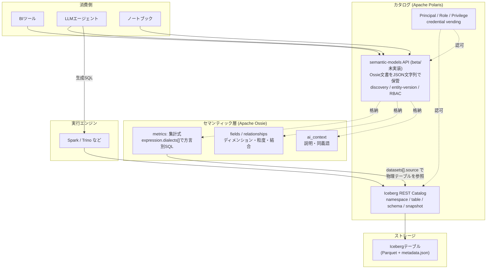

調査日: 2026-07-19（以下、URL末尾の「アクセス: 2026-07-19」は全項目共通）

## 0. 結論（先に3行）

- **Ossie 側の Polaris コネクタは「実装済み・マージ済み」**。ただし中身は Iceberg REST Catalog から**物理テーブル定義を吸い上げて Ossie YAML の雛形を作る**双方向コンバータであり、「セマンティックモデルを Polaris に置く」ものではない。
- **Polaris 側の「セマンティックモデルをカタログに格納する API」は、仕様（OpenAPI）とエンドポイントの器だけが main にマージ済みで、実装は全部 `501 Not Implemented`**。CRUD 実装の PR は 2026-07-19 時点でオープン。リリース版 Polaris（1.6.0, 2026-07-09）には**モジュールごと入っていない**。
- したがって「Ossie モデルが Polaris から discover できる」は**構想（ロードマップ）段階**。ただし API 設計（discovery / versioning / access control）はかなり具体的に固まっている。

---

## 1. 前提の確認

- Ossie は 2026-06-22 に Apache Incubator 入り。Champion は JB Onofré（Polaris の PMC メンバーでもある）、Mentor に Russell Spitzer（Iceberg）、Zili Chen、Holden Karau。committer 14名。
  出典: https://incubator.apache.org/projects/ossie.html （アクセス: 2026-07-19）
- WG は Metric Language / Catalog / Ontology の3つ。
  出典: https://ossie.apache.org/updates/ossie-enters-apache-incubator/ （2026-07-08付、アクセス: 2026-07-19）
- 仕様のリリース状況: リポジトリのタグは `osi-0.1.1-rc1` のみ（`git ls-remote --tags`）。main の `core-spec/spec.yaml` は `version: 0.2.0.dev0` で、ファイル冒頭に `# DRAFT version - in development, schema may change before 0.2.0 is released`。**ASF としての正式リリースはまだ無い**。
  出典: https://github.com/apache/ossie/blob/main/core-spec/spec.yaml （アクセス: 2026-07-19）

ROADMAP の Catalog WG 節は以下（ROADMAP.md L72-87 より逐語）:

> ### Catalog Integration & Semantic Services
> **Goal:** Integrate Ossie with data catalogs and enable centralized semantic services.
> **Motivation:** Semantic models need to be discoverable, governable, and shareable across systems.
> **Roadmap Deliverables:**
> - Integration patterns with catalogs (e.g., Polaris)
> - Standalone semantic service / registry
> - Discovery, versioning, and access control for Ossie models

出典: https://github.com/apache/ossie/blob/main/ROADMAP.md （アクセス: 2026-07-19）

なお ROADMAP がこの節に紐づけている「Related Issues」は Issue #107（ontology-query の提案）だけで、**Polaris 統合そのものを追う ASF Issue は Ossie 側には立っていない**。実作業は Polaris リポジトリ側で進んでいる（後述）。

---

## 2. 【実装済み】Ossie 側の Polaris コンバータ

場所: `converters/polaris/`（Java、Maven、Java 11+）。

- PR #94 "Add Apache Polaris converter module"、作成 2026-03-23、**マージ 2026-05-12**、作者 jbonofre。
  出典: https://github.com/apache/ossie/pull/94 （アクセス: 2026-07-19）
- 構成: `PolarisClient` / `PolarisImporter` / `PolarisExporter` / `OsiModelParser` / `OsiYamlGenerator` / `OsiPolarisConverter`。
  出典: https://github.com/apache/ossie/tree/main/converters/polaris （アクセス: 2026-07-19）
- `PolarisClient` の javadoc に「Polaris implements the Iceberg REST Catalog specification. This client communicates with the catalog endpoints to list namespaces, tables, and retrieve table metadata (schemas).」とある。認証は `POST /api/catalog/v1/oauth/tokens`（OAuth2 client_credentials、`scope=PRINCIPAL_ROLE:ALL`）または bearer token 直指定。名前空間一覧は `GET /api/catalog/v1/{catalog}/namespaces`。
  出典: https://github.com/apache/ossie/blob/main/converters/polaris/src/main/java/org/apache/ossie/converter/polaris/PolarisClient.java （アクセス: 2026-07-19）

### マッピング（PR #94 本文・コメントより）

| Polaris / Iceberg | Ossie |
|---|---|
| namespace | semantic model |
| Iceberg table | dataset |
| Iceberg schema field | field（`ANSI_SQL` 式として） |
| Iceberg identifier field | primary key |

CLI 例（PR #94 コメント、jbonofre、2026-03-23）:

```
java -jar osi-polaris-converter.jar import \
  --url http://localhost:8181 --catalog my_catalog \
  --client-id <id> --client-secret <secret> -o output.yaml

java -jar osi-polaris-converter.jar export \
  --url http://localhost:8181 --catalog my_catalog \
  --token <bearer-token> model.yaml
```

### ここが重要な限界

1. **メトリクスは往復しない。** import は Iceberg スキーマから datasets/fields/PK/時間ディメンションを起こすだけで、メトリクス定義（Ossie の本体価値）は生成されない。export 側は Ossie YAML から Iceberg テーブルを「作る」ので、型は推測ベース（フィールド説明に埋めた round-trip ヒント、`*_id` は `long`、不明なら `string`）。
   出典: https://github.com/apache/ossie/blob/main/converters/polaris/README.md （アクセス: 2026-07-19）
2. **実 Polaris に対する結合テストは未完。** PR #94 の Test plan は「Unit tests pass (9 tests)」だけチェック済みで、「Integration test against a running Polaris instance」「Verify round-trip fidelity: Polaris → OSI → Polaris」は**未チェックのままマージ**されている。
   出典: https://github.com/apache/ossie/pull/94 （アクセス: 2026-07-19）
3. その後の変更はビルド修正（#188, #189、2026-07-14、Yong Zheng）と Dependabot（#201）のみ。機能面の進展は 2026-05 のマージ以降ない。
   出典: https://github.com/apache/ossie/commits/main/converters/polaris （アクセス: 2026-07-19）

つまりこのコンバータは「カタログ統合」というより**Ossie モデルのブートストラップ支援ツール**。「セマンティックモデルがカタログから discover できる」という話とは別物。

---

## 3. 【構想＋一部足場のみ実装】Polaris 側の Semantic Model API

こちらが本命。Ossie ではなく **apache/polaris リポジトリ**で進んでいる。

### 3-1. 動機（Issue #4522、flyrain、2026-05-21、オープン）

逐語:

> Polaris already governs physical table metadata via the Iceberg/Polaris REST Catalog API. The semantic layer above those tables is currently scattered across dbt projects, Cube definitions, BI-tool-specific YAML, and vendor-owned semantic views. Each consumer (BI dashboard, LLM agent, notebook) re-derives definitions like "monthly recurring revenue" from incomplete inputs.

挙げられているユースケースは3つ:

1. **AI エージェントのグラウンディング** — エージェントが Ossie モデルをロードし、`ai_context` の説明・同義語を読み、`dataset.source` を辿って実テーブルに到達してクエリを組む。「Polaris is the system of record for 'what metrics exist and what do they mean.'」
2. **BI のカタログブラウズ** — namespace 配下のセマンティックモデルを Polaris API で列挙し、メトリクス一覧を BI 側に取り込む。
3. **マルチエンジンでのメトリクス一致** — `monthly_recurring_revenue` を Polaris に一度定義し、Spark / Trino などが `expression.dialects[]` から自分の方言を選んで同じ数字を出す。

出典: https://github.com/apache/polaris/issues/4522 （アクセス: 2026-07-19）
※このIssueは 2026-06-23 に stale ボットにマークされており、Issue上での議論コメントは（ボット以外）ゼロ。設計議論はPR上で進んでいる形。

### 3-2. 実装済みなのは「器」だけ

- PR #4816 "Feat: Add OSI semantic-model API scaffolding"、作成 2026-06-17、**マージ 2026-07-01**、flyrain。本文に「Wire the Open Semantic Interchange (OSI) semantic-model REST endpoints behind the ENABLE_SEMANTIC_MODELS feature flag (**default false until the implementation lands**)」。
  出典: https://github.com/apache/polaris/pull/4816 （アクセス: 2026-07-19）
- PR #4983 "Mark OSI semantic-model API as beta"、マージ 2026-07-07。
  出典: https://github.com/apache/polaris/pull/4983 （アクセス: 2026-07-19）
- 実体 `SemanticModelCatalogAdapter.java` のクラス javadoc: 「... but every operation returns `501 Not Implemented`」。5メソッド全部に `// TODO: authorize the principal, ...` が残る。
  出典: https://github.com/apache/polaris/blob/main/extensions/semantic-models/src/main/java/org/apache/polaris/service/catalog/semanticmodel/SemanticModelCatalogAdapter.java （アクセス: 2026-07-19）
- フィーチャーフラグ定義（`FeatureConfiguration.java`）: `ENABLE_SEMANTIC_MODELS`、説明に「This is a beta feature: the API is under active development and may change in a backward-incompatible way. It is disabled by default; enable it with caution」、`.defaultValue(false) // beta feature, keep it off by default`。
  出典: https://github.com/apache/polaris/blob/main/polaris-core/src/main/java/org/apache/polaris/core/config/FeatureConfiguration.java （アクセス: 2026-07-19）
- **リリース版には入っていない。** `extensions/` 配下はタグ `apache-polaris-1.6.0`（2026-07-09リリース）と `apache-polaris-1.5.0` の両方で `['auth', 'federation']` のみ。`spec/polaris-catalog-apis/semantic-models-api.yaml` を 1.6.0 タグで取得すると **HTTP 404**。
  出典: https://github.com/apache/polaris/releases および GitHub API での tree 参照（アクセス: 2026-07-19）

### 3-3. CRUD 実装 PR はまだオープン

PR #4961 "Feat: OSI semantic-model core entity and CRUD"、作成 2026-07-02、**2026-07-19 時点オープン（未マージ）**。本文「Turning the 501 scaffolding from #4816 into working create/list/load/update/drop for OSI semantic models on the JDBC backend.」

差分に含まれるファイルから設計意図が読める:

- `polaris-core/.../semantic/SemanticModelEntity.java`（新規） — セマンティックモデルが **Polaris の第一級エンティティ**になる（`PolarisEntityType.java` も変更）
- `polaris-core/.../auth/PolarisAuthorizableOperation.java` / `RbacOperationSemantics.java` の変更 — **既存の Polaris RBAC にセマンティックモデル操作を載せる**
- `SemanticDocumentValidator.java` — Ossie ドキュメントの検証
- `SemanticModelVersionMismatchException.java` — 楽観的並行制御
- テスト: `SemanticModelCatalogHandlerAuthzTest` / `...CrudTest`
- NoSQL 側の `EntityObjMappings` も変更（JDBC 以外のバックエンドも見据えている）

出典: https://github.com/apache/polaris/pull/4961/files （アクセス: 2026-07-19）

### 3-4. API の形（マージ済みの OpenAPI から確定的に読める部分）

`spec/polaris-catalog-apis/semantic-models-api.yaml`（432行）:

```
POST   /polaris/v1/{prefix}/namespaces/{namespace}/semantic-models
GET    /polaris/v1/{prefix}/namespaces/{namespace}/semantic-models
GET    /polaris/v1/{prefix}/namespaces/{namespace}/semantic-models/{semantic-model-name}
PUT    /polaris/v1/{prefix}/namespaces/{namespace}/semantic-models/{semantic-model-name}
DELETE /polaris/v1/{prefix}/namespaces/{namespace}/semantic-models/{semantic-model-name}
```

各オペレーションの description は「**Beta:** The semantic-model (Apache Ossie) API is under active development and may change in a ...」で始まる。

ボディは Ossie ドキュメントをそのまま抱える設計:

```yaml
SemanticModelDocument:
  type: object
  description: An Apache Ossie document body.
  required: [version, semantic_model]
  properties:
    version:        # The Apache Ossie spec version.   例: "0.1.1"
    semantic_model: # The Apache Ossie semantic model serialized as a JSON string.
```

出典: https://github.com/apache/polaris/blob/main/spec/polaris-catalog-apis/semantic-models-api.yaml （アクセス: 2026-07-19）

**設計上の含意**: Polaris は Ossie モデルを**不透明な JSON 文字列として保管**し、`version` でスペックバージョンを持つ。Polaris は Ossie の中身を解釈しない（＝Ossie スペックの進化と Polaris のリリースサイクルを分離できる）。ただし PR #4961 は `SemanticDocumentValidator` を足しているので、まったくの素通しではなく最低限の検証は入る見込み。

---

## 4. 「セマンティックサービス／レジストリ」の3要件が API にどう落ちているか

ROADMAP の「discovery, versioning, and access control」が、Polaris API 設計に対応する:

| 要件 | Polaris API での実現 | 状態 |
|---|---|---|
| Discovery | namespace 配下の `GET .../semantic-models` で列挙。Iceberg の catalog config エンドポイントに `Endpoint` として広告される（`SemanticModelConfigEndpoints`）——フラグOFFなら空集合を返すので、クライアントは能力ネゴシエーションで存在を判定できる | 仕様マージ済み・実装は501 |
| Versioning | `EntityVersion`: 「An opaque UTF-8 string (at most 255 characters) ... used for optimistic concurrency. A create/load/update response returns the entity's current version; supply the value you last read on a subsequent update so the change applies only if it still matches the version stored in the catalog.」 → **楽観的ロックであって、履歴つきバージョニングではない**。過去バージョンの取得APIは無い | 同上 |
| Access control | 既存 Polaris RBAC に載せる（PR #4961 で `PolarisAuthorizableOperation` に追加、Authz テストあり） | **未マージ** |

出典: 上記 semantic-models-api.yaml、および https://github.com/apache/polaris/blob/main/extensions/semantic-models/src/main/java/org/apache/polaris/service/catalog/semanticmodel/SemanticModelConfigEndpoints.java （アクセス: 2026-07-19）

「ここが弱い」と読める点: Ossie ROADMAP は "versioning" と言っているが、Polaris 側の設計は今のところ**同時更新の衝突検知**にとどまる。「先月のメトリクス定義で再計算したい」という監査系の要求には答えられない。

なお ROADMAP のもう一つの成果物「Standalone semantic service / registry」（カタログに依らない独立レジストリ）については、**apache/ossie にも apache/polaris にも実装・設計提案が見つからなかった**。Catalog WG への参加方法を尋ねる Discussion #? が2026-05-28に立って未回答のまま、という状況もある（下記「未確認事項」参照）。

---

## 5. 責務分担 — どこまでがカタログで、どこからがセマンティック層か

Issue #4522 の言い回し（"Polaris already governs physical table metadata via the Iceberg/Polaris REST Catalog API. The semantic layer above those tables is..."）と、Ossie spec の `datasets[].source`（コメント: `Format should be either database_name.schema_name.table_name or query`）が接合点。



線引きの整理:

- **カタログの仕事**: テーブルが「どこにあり」「どんな物理スキーマで」「誰が触れてよいか」。Iceberg REST Catalog の守備範囲。加えて Polaris は credential vending と RBAC。
- **セマンティック層の仕事**: そのテーブル群を「どう解釈するか」。メトリクスの集計式、粒度、結合関係、業務語彙。ここは Iceberg のスキーマには一切書けない。
- **境界**: Ossie の `datasets[].source` 文字列。ここでセマンティック層が物理層を**参照**する。逆向きの参照は無い（Iceberg テーブルは自分を使うメトリクスを知らない）。
- **なぜカタログに寄せるのか**: 認可基盤とディスカバリ経路を二重に作らずに済むから。Issue #4522 が Polaris を「system of record for what metrics exist and what they mean」と位置づけたのは、RBAC を再発明したくないという実務的判断と読める。

一方でこの設計には未解決の緊張がある。Ossie の Discussion #57 "Organizing multiple datasets, metrics"（vigneshc、2026-02-04）では、単一ファイルのモデルは data mart 規模を想定しており、組織全体を覆うには ontology 層が要る、という整理が回答側から出ている。namespace 単位でモデルを置く Polaris の設計は、この「data mart 規模の単位」と噛み合う一方、組織横断の概念整合は Ontology WG 側の宿題として残る。
出典: https://github.com/apache/ossie/discussions/57 （アクセス: 2026-07-19）

---

## 6. Iceberg REST Catalog との噛み合い方

3点、具体的に確認できたこと。

1. **パスは分けている。** semantic-models は `/polaris/v1/{prefix}/namespaces/{namespace}/semantic-models` であり、Iceberg REST Catalog の `/api/catalog/v1/...` 名前空間の下ではない。Iceberg スペックを汚さずに、**namespace 階層だけ共有する**設計。
2. **能力ネゴシエーションは Iceberg の仕組みに乗せている。** `SemanticModelConfigEndpoints` は Iceberg の `org.apache.iceberg.rest.Endpoint` 型を返す `CatalogConfigEndpointContributor` として実装されており、catalog config レスポンス経由でクライアントに広告される。フラグOFFなら `ImmutableSet.of()`。既存 Iceberg クライアントは無視でき、対応クライアントだけが使う。
3. **Ossie 側コンバータは純粋に IRC クライアント**として書かれている（§2）。つまり現時点の実装レベルでは、Ossie は Polaris の独自 API ではなく **Iceberg REST Catalog の標準部分にしか依存していない**。これは他の IRC 実装（Lakekeeper, Nessie, Unity Catalog の IRC エンドポイント等）にも同じコンバータが原理的には向けられることを意味する（実際に動かした報告は未確認）。

構図としては、**Iceberg REST Catalog がテーブル層の標準化を終えた結果、その一段上の「意味」の標準化が次の空白地帯として露出した**、という順序。Ossie の Champion が Polaris の JB Onofré で、Mentor に Iceberg の Russell Spitzer が入っているのは、この連続性を人的にも反映している。

---

## 7. 競合・類似アプローチ

### Databricks / Unity Catalog（最も進んでいる）

- Unity Catalog Business Semantics が **GA**。発表日 2026-04-02。中核は「metric views」。
- 「we are open sourcing the core Metric View implementation in Apache Spark OSS, targeting the upcoming Apache Spark release ... with support in Unity Catalog OSS v0.5 coming soon」（SPARK-54119）。
- OSI については「Databricks also supports broader industry efforts to improve interoperability around business semantics. The company has joined the Open Semantic Interchange (OSI) initiative and is actively contributing to it.」
  出典: https://www.databricks.com/blog/redefining-semantics-data-layer-future-bi-and-ai （アクセス: 2026-07-19）
- Unity Catalog OSS 側にも実体がある: PR #1493 "[API] Add METRIC_VIEW table type and view_definition/view_dependencies"、**マージ済み**（2026-04-17作成）。
  出典: https://github.com/unitycatalog/unitycatalog/pull/1493 （アクセス: 2026-07-19）

**Polaris との対比が効く**: Unity Catalog は metric view を**テーブル型の一種**として既存カタログモデルに組み込んだ（GA、実装済み）。Polaris は Ossie 文書を**別エンティティ型**として持つ設計で、まだ 501。方向性は「自社仕様を先に出荷して後から OSI 互換を主張する Databricks」対「最初から中立仕様を格納する Polaris」。ただし Databricks も Ossie に貢献しており、Ossie リポジトリのコミッタ組織に Databricks が含まれる。
出典: https://ossie.apache.org/updates/ossie-enters-apache-incubator/ （アクセス: 2026-07-19）

### Apache Gravitino

apache/gravitino リポジトリを OSI / semantic layer で検索したが、**関連する Issue/PR は見つからなかった**（ヒットしたのは無関係な古いもの2件のみ）。Gravitino 本体にセマンティック層機能は現時点で確認できない。「Gravitino 上に OSI モデルのガバンドレジストリを作る」という趣旨のベンダー記述を検索結果で見かけたが、一次情報で裏が取れていない（→未確認事項）。
出典: GitHub API search over apache/gravitino （アクセス: 2026-07-19）

### その他

Ossie のコンバータ実装は `dbt`, `gooddata`, `honeydew`, `omni`, `orionbelt`, `polaris` の6つ。`converters/README.md` が列挙する vendor extension 識別子は `SNOWFLAKE` / `SALESFORCE` / `DBT` / `DATABRICKS` / `OMNI`。
出典: https://github.com/apache/ossie/tree/main/converters （アクセス: 2026-07-19）

---

## 8. 実装済み／構想段階の切り分け（一覧）

| 項目 | 状態 | 根拠 |
|---|---|---|
| Ossie → Polaris コンバータ（IRC経由の import/export） | **実装済み・マージ済み**（2026-05-12） | apache/ossie PR #94 |
| 同・実 Polaris への結合テスト、往復忠実性検証 | **未完** | PR #94 の未チェックのTest plan |
| メトリクス定義のコンバータ往復 | **無し**（物理スキーマのみ） | converters/polaris/README.md |
| Polaris semantic-models OpenAPI 仕様 | **マージ済み**（2026-07-01、beta表記） | apache/polaris PR #4816, #4983 |
| Polaris semantic-models のエンドポイント実体 | **501 Not Implemented** | SemanticModelCatalogAdapter.java |
| フィーチャーフラグ `ENABLE_SEMANTIC_MODELS` | 存在するが **default false** | FeatureConfiguration.java |
| Polaris semantic-models の CRUD 実装 | **PR オープン（未マージ）** | apache/polaris PR #4961 |
| セマンティックモデルの RBAC 統合 | **未マージ**（#4961 に含まれる） | PR #4961 の差分 |
| リリース済み Polaris での利用 | **不可**（1.5.0 / 1.6.0 に該当モジュール無し） | タグ tree 参照・1.6.0 で spec が 404 |
| 「Standalone semantic service / registry」 | **構想のみ**（設計提案も未発見） | ROADMAP.md |
| Ossie 仕様の正式リリース | **未**（タグは rc1 のみ、main は 0.2.0.dev0 DRAFT） | git tags, core-spec/spec.yaml |
| Unity Catalog metric views | **GA（2026-04-02）**、OSS 実装も進行 | Databricks blog, unitycatalog PR #1493 |

---

## 9. ブログ記事にするなら（メモ）

- 既存の「Iceberg と REST Catalog」記事の続きとして、「IRC が物理層の標準化を終えたので、次の空白は意味の層だった」という接続で入るのが自然。
- 一番おいしいネタは **§3-4 の「Ossie 文書を不透明な JSON 文字列として保管する」設計判断**。カタログが仕様の中身を解釈しないことで、スペックの進化速度とカタログのリリースサイクルを切り離している。これは Iceberg の metadata.json をカタログがポインタとしてだけ持つのと同じ思想。
- 対比軸は Databricks（テーブル型として組み込み、GA済み）対 Polaris（別エンティティ、まだ501）。速度と中立性のトレードオフとして書ける。
- 注意: 「Polaris と Ossie が統合された」と書くと誤り。「統合のための API 形状が決まり、器がマージされた段階」が正確。

---

## 未確認事項

- **Ossie の ML アーカイブが読めていない。** `lists.apache.org` の API で `dev@ossie.apache.org` / `dev@ossie.incubator.apache.org` を叩いても hits 0。Ossie 側 Issue #193「Incorrect mailing list in incubating site」（2026-07-14、closed）があり、ML 周りが移行中／未インデックスの可能性。**ML 上での Polaris 統合の議論の有無は未確認**。apache/polaris の dev@ を "ossie" / "semantic" で検索しても該当スレッド 0 件で、設計議論は GitHub PR 上に閉じている模様（これも網羅性は保証できない）。
- **Catalog WG の会議体・議事録の所在が不明。** ossie.apache.org は「dedicated leads, meetings and public channels」と書くが、議事録の公開場所を特定できていない。Discussion「How can I join the Catalog Integration WG?」（KazunoriSakamoto、2026-05-28）が未回答のまま。WG が実際にどれだけ稼働しているかは未確認。
- **Slack チャンネルの内容は未取得**（招待制のため）。
- **Gravitino 上の OSI レジストリ**という記述を検索結果で見たが、一次情報にたどり着けず。ベンダー（Datastrato 系）のマーケティング文言の可能性が高いが、断定できない。
- **PR #4961 のレビュー状況・議論内容を読んでいない**（ファイル一覧と本文のみ確認）。マージ見込み時期は不明。
- **Snowflake / Dremio 等の商用製品側で Ossie モデルを Polaris に置く実装**があるかは未調査。
- **Ossie の `ai_context` フィールド**を Issue #4522 が参照しているが、これが現行 spec.yaml のどのバージョンで定義されているか未確認（0.2.0.dev0 の該当箇所を精読していない）。
- Iceberg REST Catalog の他実装（Lakekeeper, Nessie 等）に対して Ossie の Polaris コンバータが動くかは**推論であり、検証報告は未確認**。
